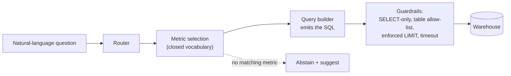
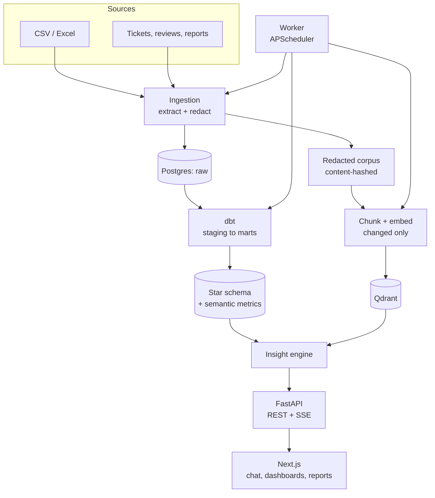
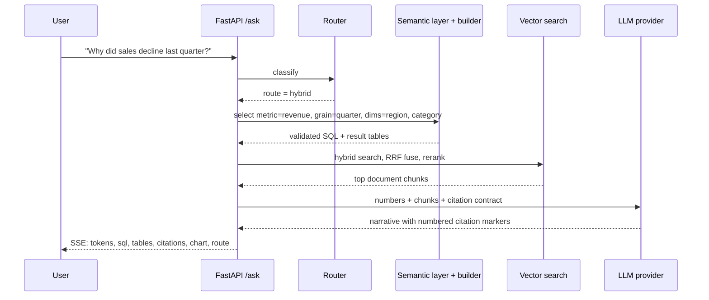

# InsightGPT

**Ask your business data a question in plain English. Get a cited answer, the
SQL behind every number, and an honest "I don't know" when the data can't
support one.**

InsightGPT is an end-to-end data-engineering + LLM platform: an ELT pipeline
into a modeled Postgres warehouse, a hybrid vector search over redacted business
documents, and an insight engine that answers questions by combining both.

The difference from a text-to-SQL demo is one design decision: **the model never
writes SQL.** It selects from a governed semantic layer of 8 metrics and 8
dimensions, and a query builder emits the SQL. It cannot invent a join, a
filter, or a number — and when a question falls outside the layer, it abstains
instead of guessing.

---

## See it work

Everything below is verbatim output from a running API — no illustration, no
tidying beyond trimming. It was captured against the **deterministic offline
stack** (DuckDB fixture warehouse + offline provider) that the eval harnesses
also run on, so these exact figures reproduce on any machine with
the offline defaults (`LLM_PROVIDER=fake`, no `WAREHOUSE=postgres`). The Docker
stack returns the same response envelope over the real Postgres warehouse, the
Qdrant index and your configured LLM; the figures there come from the generated
dataset, which is larger.

**Q: "Why did sales decline last quarter?"**

```
Revenue fell 11.4% (1,300,000 -> 1,152,000) from 2026Q1 to 2026Q2. The change
was driven mainly by the North region (-130,000) and the Electronics category
(-118,400). Documents for the period attribute this to fulfilment delays at the
North distribution centre [1][2][3][4][5].
```

It shows its work. The same response carries the **SQL** it ran — seven
statements for this question; here is the one that produced the regional
breakdown, unedited:

```sql
SELECT region AS region, SUM(gross_revenue - discount_amount) AS revenue
FROM fact_order_items
JOIN dim_customer ON fact_order_items.customer_key = dim_customer.customer_key
JOIN dim_date ON fact_order_items.date_key = dim_date.date_key
WHERE dim_date.full_date BETWEEN ? AND ?
GROUP BY 1
ORDER BY 1
LIMIT 1000
```

…the **tables** it produced…

| region | prior | current | delta |
|---|---|---|---|
| North | 400000.0 | 270000.0 | **-130000.0** |
| South | 320000.0 | 313600.0 | -6400.0 |
| West | 300000.0 | 294000.0 | -6000.0 |
| East | 280000.0 | 274400.0 | -5600.0 |

…and the **documents** behind the narrative claim:

| # | Document | Type | Date |
|---|---|---|---|
| 1 | Late delivery — North region electronics | ticket | 2026-05-08 |
| 2 | Arrived two weeks late | review | 2026-05-19 |
| 3 | North fulfilment backlog escalation | ticket | 2026-05-27 |
| 4 | Q2 operations review | report | 2026-06-30 |
| 5 | Great apparel selection | review | 2026-05-11 |

The numbers come from SQL over the warehouse; the *cause* comes from documents.
Neither is generated prose.

### And when it can't answer

**Q: "What was our churn rate?"**

```
I can't answer that reliably, so I won't guess. 'churn rate' is not a governed
metric, so I cannot compute it reliably.

Suggestions:
  Try the governed metric 'return_rate'.
  Try the governed metric 'units_sold'.
```

Route: `abstain`, confidence `low`, no number invented. A system that can say no
is the point — an analytics assistant that always produces a number is a system
you cannot trust with the ones that matter.

---

## Why the semantic layer changes the safety story



The LLM's output at the SQL step is a **selection**, not a statement — a metric
key, dimensions, a time range. The builder turns that into parameterized SQL.
Everything then passes a validator that rejects non-`SELECT` statements, tables
outside the allow-list, and joins that reach an unmodeled table, and enforces a
row limit and a statement timeout.

When a selection fails or comes back clearly wrong, a **bounded self-correction
loop** retries the *selection* (never free SQL), records each attempt with the
reason it was rejected, and gives up rather than looping.

---

## Capabilities, and how each one is proven

Every number below came from running the command or test named beside it — none
of it is estimated, and there are no benchmarks from anywhere but this repo.

| Capability | Evidence |
|---|---|
| Grounded text-to-SQL over a governed layer | `make eval` — execution accuracy **1.000** (12/12), routing accuracy **1.000** (13/13), metric-selection accuracy **1.000** (12/12), against floors of 0.90 |
| Answers stay faithful to their sources | `make eval` — groundedness **1.000** (12/12 sentences), citation coverage **1.000** (16/16 markers resolve), no-fabricated-number rate **1.000** (8/8) |
| Abstains rather than guessing | 2/2 out-of-scope probes abstained in the eval set; `services/api/tests/test_engine_selfcorrect.py::test_unknown_metric_abstains_with_suggestion_and_no_number` |
| SQL guardrails hold | `services/api/tests/test_guardrails.py` — writes/DDL rejected, non-allow-listed tables rejected, joins reaching unmodeled tables rejected |
| Self-correction is bounded, not a retry loop | `test_bounded_retries_give_up_without_looping`, `test_build_rejection_triggers_correction_not_error` |
| Secrets and PII never reach the vector store | `services/ingestion/tests/test_redact.py` (tokens, emails, phones, Luhn-gated card numbers, private-key blocks) + `test_handoff.py::test_published_documents_are_redacted` |
| Hybrid retrieval earns its second stage | `services/retrieval/retrieval/eval.py` scores Recall@1/@3 and MRR with reranking off vs. on against a golden set (needs live Qdrant + Ollama) |
| Automatic insight detection with root cause | `GET /api/v1/insights` returns period-over-period movers with a contribution breakdown; covered by `services/api/tests/test_insights.py` |
| The whole thing actually runs | 367 tests pass across the five offline suites: api 158, retrieval 108 (1 skipped), generator + drift 42, worker 34, ingestion 25 |

Run it all yourself: `make ci-local` (lint + every offline suite + both eval
harnesses; no Docker, no network, no models).

---

## Quick start

**One command, from a fresh clone.** It checks prerequisites, writes `.env` with
a generated secret, picks free ports, builds the images, starts every service,
loads the demo warehouse, indexes the documents, and then *proves it works* by
asking a real question end to end.

**Windows**

```bash
setup.cmd
```

**macOS / Linux**

```bash
./setup.sh
```

**Prerequisites:** Docker Desktop (running). Nothing else — the script installs
the Python toolchain it needs if your machine has none. The first run pulls
local models, so it takes a while and benefits from a GPU (CPU works, slower —
see [`docs/09-deployment.md`](docs/09-deployment.md) §5).

The script is **idempotent**: if anything fails, fix the cause it names and run
it again — completed steps become fast no-ops.

Then open:

- **web** — http://localhost:3000
- **api** — http://localhost:8000 (health: `GET /health`)

Sign in with one of the seeded demo accounts:

| Role | Email | Password |
|---|---|---|
| Admin | `admin@insightgpt.dev` | `admin-pass` |
| Analyst | `analyst@insightgpt.dev` | `analyst-pass` |
| Viewer | `viewer@insightgpt.dev` | `viewer-pass` |

These are demo credentials for the local stack, not secrets — a real deployment
replaces the in-memory user store (see [`docs/08-security.md`](docs/08-security.md)).

Ask *"Why did sales decline last quarter?"* — you get the shape of answer shown
at the top of this file, computed over the generated dataset. Then run the
five-minute tour in [`docs/14-demo.md`](docs/14-demo.md).

### If something breaks

| Command | What it does |
|---|---|
| `./setup.sh --doctor` | Diagnose only. Changes nothing, names the exact broken thing. |
| `./setup.sh --repair` | Clean rebuild + recreate, re-seed, re-verify. Your `.env` is preserved. |
| `./setup.sh --skip-models` | Set up without pulling Ollama models (fast; retrieval quality degraded). |
| `./setup.sh --native` | No Docker: prepare the local dev stack on the built-in sample dataset. |

On Windows the same flags work: `setup.cmd --doctor`, `setup.cmd --repair`, and so on.

Your edits are safe: `.env` is created if missing and gap-filled when a `git
pull` adds a new variable, but values you have set are never overwritten.

---

## Architecture



Full design and the rejected alternatives are in
[`docs/01-architecture.md`](docs/01-architecture.md).

### One question, end to end



Each SSE event is separate on purpose: the UI can render the number and the SQL
before the narrative has finished streaming, and a client that only wants the
data can ignore the prose entirely. `Accept: application/json` returns the same
envelope in one shot.

### Stack

| Layer | Technology |
|---|---|
| Warehouse | PostgreSQL + **dbt** (star schema + semantic metrics) |
| Vector DB / retrieval | **Qdrant** + local embeddings & rerank (**Ollama**), hybrid dense/sparse search with RRF fusion |
| Insight engine | Semantic-layer-grounded metric selection + RAG synthesis |
| LLM access | **Pluggable provider** for the chat step (local Ollama default; OpenAI / Groq optional). Embeddings and rerank are always local Ollama. |
| Orchestration | Worker + **APScheduler** (pipeline runs & tracking) |
| API | **FastAPI** (Python 3.12), JWT auth + roles, SSE streaming |
| Frontend | **Next.js** + TypeScript + Tailwind + shadcn/ui |
| Packaging | **Docker Compose**, cloud-portable |
| Demo domain | Retail / e-commerce (synthetic, with a deliberately planted cause) |

### Topology

Six services on a private compose network; only `web` and `api` publish ports.

| Service | Image / build | Port | Role |
|---|---|---|---|
| `web` | `docker/web.Dockerfile` | `3000` (published) | Next.js frontend |
| `api` | `docker/api.Dockerfile` | `8000` (published) | FastAPI REST + SSE, insight engine, auth |
| `worker` | `docker/worker.Dockerfile` | — internal | APScheduler jobs, dbt, pipeline runs |
| `postgres` | `postgres:16` | — internal (loopback) | Warehouse (`raw` / `marts` / `insight`) |
| `qdrant` | `qdrant/qdrant` | — internal | Vector DB |
| `ollama` | `ollama/ollama` | — internal | Local embeddings, rerank, default LLM |

Persistent state lives in named volumes: `pgdata`, `qdrant_storage`,
`ollama_models`, plus `generated_data` and `ingested_data` for the synthetic
dataset and the redacted document corpus (the seed runs in a throwaway
container; the scheduler that indexes the corpus does not).

`api` and `worker` wait for `postgres` and `ollama` to be **healthy** before
starting, and for `qdrant` to have **started** — the Qdrant image is distroless,
with no shell or curl for a healthcheck to use, so readiness is enforced by the
clients' own retries and by bootstrap polling `/readyz`. `web` waits for `api`
to be healthy.

---

## Working with it

### Make targets

| Target | What it does |
|---|---|
| `make setup` | **First run.** Check prerequisites, configure, build, start, seed and verify end to end |
| `make doctor` | Diagnose the install; changes nothing |
| `make repair` | Clean rebuild + recreate, re-seed, re-verify |
| `make up` | Build and start the full stack (`docker compose up --build -d`) |
| `make bootstrap` | First-run: pull Ollama models, build the warehouse (generate → load raw + publish the document corpus → dbt), create the Qdrant collection, index that corpus. Idempotent. |
| `make down` | Stop the stack (named volumes preserved) |
| `make logs` | Tail all service logs |
| `make seed` | (Re)build the warehouse and republish the document corpus |
| `make reindex` | Re-embed changed documents into Qdrant, tracked as a pipeline run |
| `make test` | Run every offline test suite (api, retrieval, ingestion, worker, generator, semantic-layer drift) |
| `make eval` | Run the text-to-SQL + faithfulness harnesses (floors + scoreboards) |
| `make ci-local` | Everything CI runs without Docker: lint + tests + eval |
| `make lint` | Ruff over every Python package |
| `make clean` | Stop and **delete** all data volumes (destructive) |

### Running the steps by hand

```bash
make env                    # copy .env.example -> .env
make up                     # build + start all six services
make bootstrap              # first run only: pull models, build warehouse, index docs
```

> **Run compose from the repo root.** `make up` and a plain
> `docker compose up --build` both work. Do **not** run
> `docker compose -f docker/compose.yml up` directly: compose would take
> `docker/` as its project directory, never read the root `.env`, and silently
> fall back to every built-in default — so your `LLM_PROVIDER` would be ignored
> with no warning. See [`docs/09-deployment.md`](docs/09-deployment.md) §2.1.

### The pipeline, end to end

Ingestion redacts the generated documents and publishes them to
`data/ingested/documents.json` with a content hash per document; the worker's
`reindex_docs` job reads exactly that file and re-embeds only what changed,
deleting the chunks of anything that disappeared upstream. Each job is
individually runnable and records a row in `insight.pipeline_runs`:

```bash
python -m worker run full_ingest        # reload raw.* + republish the corpus
python -m worker run incremental_sync   # changed units only
python -m worker run dbt_build          # staging -> marts + metrics
python -m worker run reindex_docs       # changed documents -> Qdrant
```

Configuration is env-driven ([`.env.example`](.env.example) documents every
variable). The same images deploy to a single cloud VM unchanged, or decompose
onto a managed platform — see [`docs/09-deployment.md`](docs/09-deployment.md) §5.

---

## Status: what is built, and what is not

The system runs end to end: ingestion with redaction, the dbt warehouse and its
semantic layer, hybrid retrieval, the insight engine with guardrails and
abstention, the FastAPI surface with JWT auth and SSE, the Next.js UI, the
scheduled worker, and both eval harnesses. CI runs lint, every Python suite, the
drift guards, a real dbt build on a throwaway Postgres, the web build, and the
evals on every push.

Designed in the docs and **deliberately not built**:

| Not built | Where it is designed | Why not |
|---|---|---|
| Event-driven job chaining | [`docs/03-ingestion-etl.md`](docs/03-ingestion-etl.md) §5.1 | Each job is idempotent and gates its own work, so chaining is not needed for correctness; the two 30-minute jobs are offset instead |
| Watermark-based incremental sync for SQL sources | [`docs/03-ingestion-etl.md`](docs/03-ingestion-etl.md) §3.2 | The SQL source connector itself is designed but not built; file and document sources use content hashes |
| Separate read-only Postgres role | [`docs/08-security.md`](docs/08-security.md) §3 | The single-role deployment relies on the SELECT-only validator, allow-list, limit and timeout; the role split is a defence-in-depth layer, not the primary control |
| `config/runtime.json` for discovered ports | [`docs/11-roadmap.md`](docs/11-roadmap.md) Phase 0 | Passing ports through the environment turned out to be enough |
| Frontend test suite (Vitest / Playwright) | [`docs/10-testing-eval.md`](docs/10-testing-eval.md) | Not written; the web app is covered only by its type-check and build in CI |

Recording these is deliberate. A rejected alternative that is written down is
worth more than a feature list that quietly omits it.

---

## Documentation

Start with the docs index: [`docs/README.md`](docs/README.md).

- [`00-overview.md`](docs/00-overview.md) — problem, goals, personas
- [`01-architecture.md`](docs/01-architecture.md) — system design & rationale
- [`02-data-model.md`](docs/02-data-model.md) — warehouse & semantic layer
- [`03-ingestion-etl.md`](docs/03-ingestion-etl.md) — connectors & ELT
- [`04-retrieval-rag.md`](docs/04-retrieval-rag.md) — vector search pipeline
- [`05-insight-engine.md`](docs/05-insight-engine.md) — the reasoning core
- [`06-api.md`](docs/06-api.md) — FastAPI surface
- [`07-frontend.md`](docs/07-frontend.md) — Next.js app
- [`08-security.md`](docs/08-security.md) — threat model & defenses
- [`09-deployment.md`](docs/09-deployment.md) — Docker Compose & cloud path
- [`10-testing-eval.md`](docs/10-testing-eval.md) — tests & eval harnesses
- [`11-roadmap.md`](docs/11-roadmap.md) — phased build plan
- [`14-demo.md`](docs/14-demo.md) — five-minute demo walkthrough

## License

MIT
