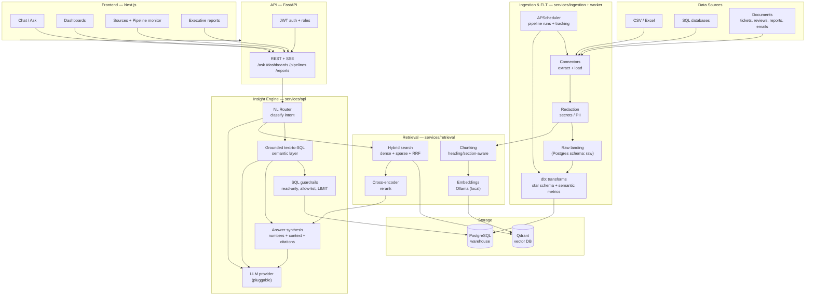
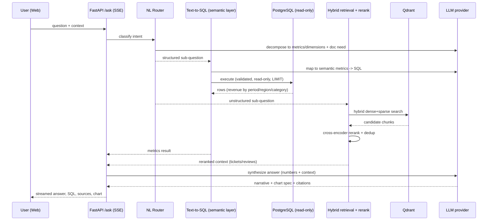
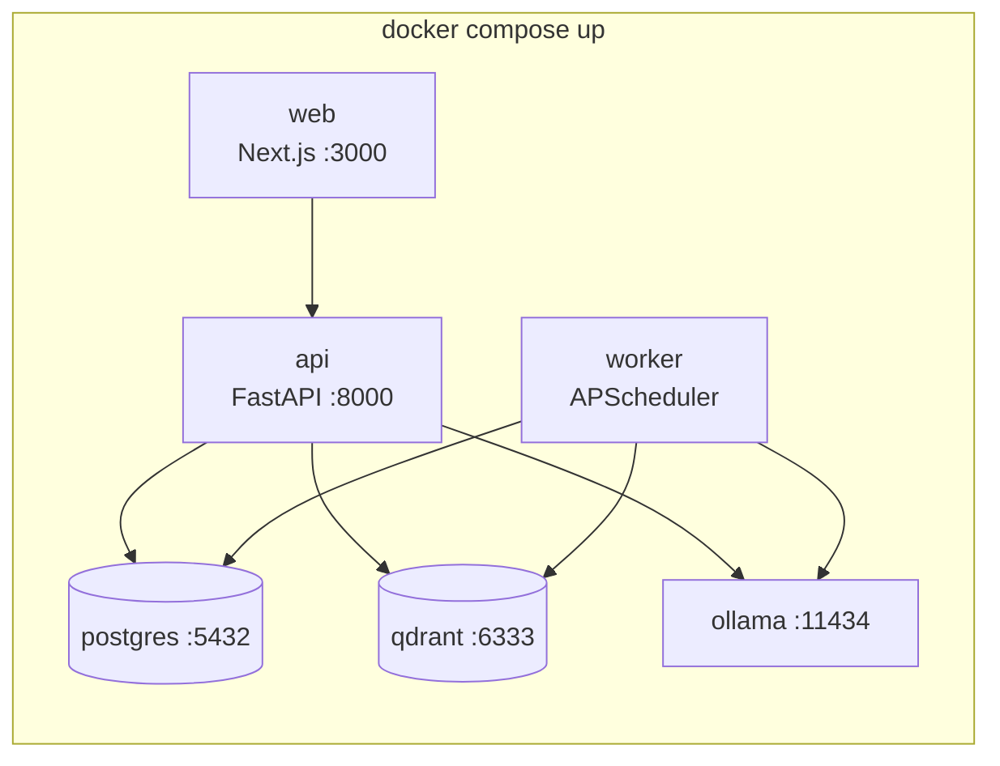

# 01 — System Architecture

This document is the architectural source of truth. Every other doc elaborates
one box in the diagrams below.

## 1. Design principles

1. **Explainability over cleverness.** An answer is only useful if its basis is
   visible — the SQL behind a number, the documents behind a claim. Grounding
   beats free-form generation.
2. **Grounded, not guessing.** The LLM maps questions onto a **governed
   semantic layer**; it does not author arbitrary joins. This is the single
   biggest reliability lever (see `05-insight-engine.md`).
3. **Local-first, cloud-optional.** Defaults run on a modest laptop (Ollama
   embeddings + rerank); heavy reasoning is a pluggable provider.
4. **Config-driven & idempotent.** No hardcoded ports/paths; YAML config,
   discovered runtime values, re-runnable setup. (Inherited from `rememory`.)
5. **Secure by construction.** Redaction at ingestion, read-only analytics
   role, allow-listed tables, no secrets in the vector store.
6. **Composable services.** Each concern is an independently runnable service,
   wired by Docker Compose.

## 2. High-level architecture



## 3. Request flow — "Why did sales decline last quarter?"



## 4. Components

### 4.1 Ingestion & ELT (`services/ingestion`, `services/worker`)
Source connectors extract records/documents and **load raw** into a Postgres
`raw` schema (structured) and hand documents to the retrieval indexer.
**Redaction** runs before anything is persisted or embedded. **dbt** transforms
raw → staging → modeled star schema and defines the **semantic metrics**.
**APScheduler** (inside the worker service) schedules and tracks pipeline runs;
each run records status, row counts, and timings. Detail: `03-ingestion-etl.md`.

### 4.2 Warehouse (`services/warehouse` = dbt project + Postgres)
PostgreSQL holds `raw`, `staging`, and `marts` schemas. dbt models produce fact
and dimension tables and a metrics layer that the insight engine targets. dbt
tests enforce data quality. Detail: `02-data-model.md`.

### 4.3 Retrieval / RAG (`services/retrieval`)
Documents are chunked (heading/section-aware), embedded locally via Ollama, and
stored in Qdrant with both dense and sparse vectors. Query time: hybrid
retrieval fused with RRF → cross-encoder rerank → per-source diversity. Patterns
reused from `rememory`. Detail: `04-retrieval-rag.md`.

### 4.4 Insight engine (`services/api`, insight module)
The brain. An **NL router** classifies each question into a structured path
(grounded text-to-SQL), an unstructured path (RAG), or a hybrid of both, then
**synthesizes** a single cited answer with an optional chart spec. All SQL is
routed through **guardrails**. The **LLM provider** is pluggable. Detail:
`05-insight-engine.md`.

### 4.5 API (`services/api`)
FastAPI exposes REST + SSE endpoints, JWT auth with roles
(admin/analyst/viewer), and request/LLM tracing. Detail: `06-api.md`.

### 4.6 Frontend (`web/`)
Next.js + TypeScript + Tailwind + shadcn/ui. Conversational analytics,
interactive dashboards, data-source administration, pipeline monitoring, and
executive report generation/export. Detail: `07-frontend.md`.

## 5. Technology choices & rationale

Each choice lists the **rejected alternatives** and why — so reviewers see the
reasoning, not just the result (a `rememory` practice).

| Concern | Choice | Why | Rejected |
|---|---|---|---|
| Warehouse | **PostgreSQL** | Ubiquitous, real SQL, runs in Docker, deploys to any cloud, credible "warehouse" story | DuckDB (great but embedded, weaker multi-service story); Snowflake/BigQuery (signup + external dependency for a demo) |
| Transformations | **dbt (dbt-postgres)** | Industry standard; versioned, testable models; native home for the semantic layer | Hand-written SQL migrations (no lineage/tests); pandas scripts (not warehouse-native) |
| Reliability of NL→data | **Semantic-layer-grounded text-to-SQL** | 2026 benchmarks show grounding lifts accuracy from ~70–85% to ~90%+; LLM picks metrics, engine writes SQL | Free-form text-to-SQL (hallucinated joins/aggregations) |
| Vector DB | **Qdrant** | Reused from rememory; fast hybrid search, local Docker, 127.0.0.1 | pgvector (simpler but weaker hybrid + rerank ergonomics); Pinecone/cloud (external, paid) |
| Embeddings + rerank | **Ollama (local)** | Free, private, CPU-viable small models; matches rememory | Cloud embedding APIs (cost + privacy) |
| LLM reasoning | **Pluggable provider (Ollama default; OpenAI/Gemini/Groq optional)** | Runs anywhere; upgrade quality with a key; no lock-in | Single hardcoded provider (lock-in, and vendor-clean constraint) |
| Orchestration | **APScheduler + FastAPI worker** | Lightweight, no extra infra, easy to demo and reason about | Airflow/Dagster (heavy for scope); cron only (no run tracking/retries in-app) |
| API | **FastAPI** | Async, typed (pydantic), SSE streaming, great DX | Flask (less async/typing); Django (too heavy) |
| Frontend | **Next.js + Tailwind + shadcn/ui** | Portfolio-grade UI, SSR/routing, strong component ecosystem | Streamlit (fast but not "very good UI"); plain React SPA (loses SSR/routing) |
| Packaging | **Docker Compose** | One-command multi-service bring-up, cloud-portable | Bare-metal scripts (fragile); k8s (overkill for scope) |

## 6. Deployment topology



Services are loopback-bound where possible; only `web` and `api` are exposed.
Ports are discovered/overridable (no hardcoding). Cloud path documented in
`09-deployment.md`.

## 7. Cross-cutting concerns

- **Security** — redaction, read-only SQL, allow-lists, JWT/roles, prompt-
  injection defenses for document-sourced content → `08-security.md`.
- **Observability** — structured logs, request IDs, pipeline run records, LLM
  call tracing → `06-api.md`, `10-testing-eval.md`.
- **Quality** — dbt tests, pytest, retrieval + text-to-SQL eval harness, CI →
  `10-testing-eval.md`.
- **Config** — YAML in `config/`, runtime discovery in `config/runtime.json`.

## 8. Repository layout

```
insight-gpt/
  docs/                 # design docs (source of truth)
  services/
    api/                # FastAPI: routers, auth, insight engine, LLM providers
    worker/             # APScheduler jobs, pipeline runners, run tracking
    ingestion/          # connectors, redaction, loaders
    retrieval/          # Qdrant client, chunking, hybrid search, rerank
    warehouse/          # dbt project: models, semantic metrics, seeds, tests
  web/                  # Next.js frontend
  data/                 # synthetic dataset generator + sample docs (heavy = gitignored)
  config/               # *.yaml, runtime.json
  docker/               # compose.yml + per-service Dockerfiles
  scripts/              # setup, seed, diagnose, eval
  tests/                # pytest + eval harnesses
```

Detailed build sequence: `11-roadmap.md`.
