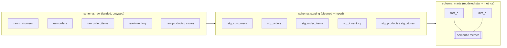
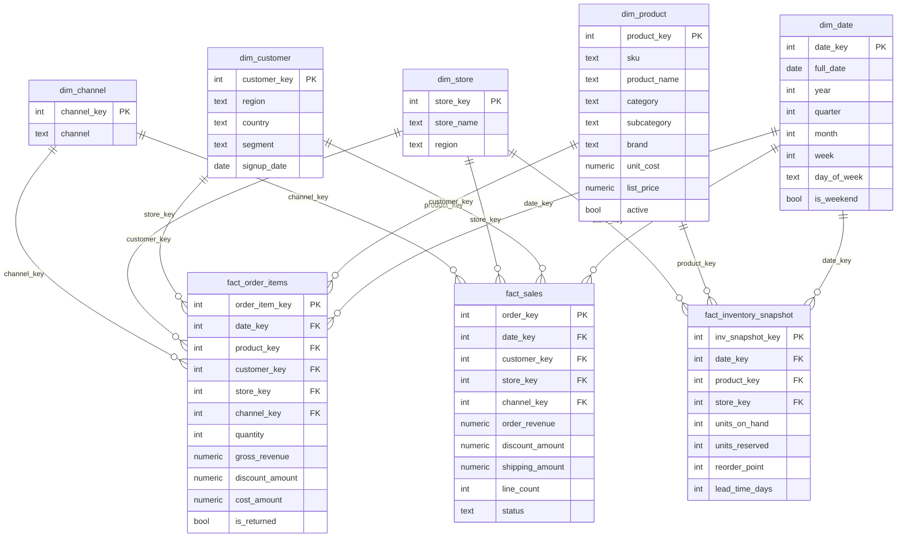

# 02 — Data Model & Warehouse

This document defines the demo domain, the source (operational) schemas, the
warehouse layering, the star schema, the dbt project structure, and the
**semantic metrics layer** that the insight engine grounds on. It is the
data-side companion to [`01-architecture.md`](01-architecture.md) §4.2 and the
target of the ELT pipeline in [`03-ingestion-etl.md`](03-ingestion-etl.md).

## 1. Why retail / e-commerce

The project needs **one** domain modeled end to end (a non-goal is competing
with general-purpose platforms — see [`00-overview.md`](00-overview.md) §5).
Retail / e-commerce is chosen because it is the shortest path to making the
three headline questions genuinely answerable rather than staged:

| Example question | What it exercises |
|---|---|
| *"Why did sales decline last quarter?"* | Time-series facts, decomposition by region/category/product/channel, and a **real** cause planted in the data — cross-referenced against document themes |
| *"Which products should we restock?"* | Inventory snapshots joined to sell-through and returns; a ranking metric over dimensions |
| *"Summarize customer complaints this month."* | Unstructured support tickets + reviews, retrieved and clustered |

Retail also gives a naturally **mixed** dataset: hard transactional numbers
(orders, line items, inventory) *and* free text (tickets, reviews, business
reports). That is exactly the structured-plus-unstructured split InsightGPT
exists to answer together, so a single domain demonstrates the whole thesis.

**Rejected alternatives.** Finance (needs licensed-advice disclaimers, and
personalized advice is out of scope); healthcare (PII/PHI sensitivity distracts
from the engineering story); SaaS product analytics (event-stream heavy, pushes
toward streaming, which is a non-goal). Retail is legible to a non-technical
demo audience and every metric has an intuitive meaning.

## 2. Source (operational) schemas

These are the **operational** shapes the connectors extract from — synthetic
CSV/Excel exports and a simulated operational SQL database
([`03-ingestion-etl.md`](03-ingestion-etl.md) §3). They land unchanged in the
Postgres `raw` schema. Types below are the *intended* types; `raw` stores them
loosely (text/jsonb) and `staging` enforces them.

### 2.1 Structured entities

**`customers`**

| Column | Type | Notes |
|---|---|---|
| `customer_id` | PK, int | Stable business key |
| `email` | text | **Redacted at ingestion** (see §8) |
| `full_name` | text | Redacted at ingestion |
| `phone` | text | Redacted at ingestion |
| `region` | text | e.g. North / South / East / West |
| `country` | text | ISO country |
| `segment` | text | consumer / SMB / enterprise |
| `signup_date` | date | Drives cohort/tenure |

**`products`**

| Column | Type | Notes |
|---|---|---|
| `product_id` | PK, int | |
| `sku` | text | Natural key printed on inventory feeds |
| `product_name` | text | |
| `category` | text | e.g. Electronics, Apparel, Home |
| `subcategory` | text | |
| `brand` | text | |
| `unit_cost` | numeric | Landed cost — feeds gross margin |
| `list_price` | numeric | Reference price |
| `active` | bool | Discontinued flag |

**`stores`** (also models online channels as "stores")

| Column | Type | Notes |
|---|---|---|
| `store_id` | PK, int | |
| `store_name` | text | |
| `channel` | text | online / retail / marketplace / wholesale |
| `region` | text | |
| `opened_date` | date | |

**`orders`** (order header — one row per order)

| Column | Type | Notes |
|---|---|---|
| `order_id` | PK, int | |
| `customer_id` | FK → customers | |
| `store_id` | FK → stores | Selling channel/store |
| `order_ts` | timestamp | Order placed |
| `status` | text | placed / shipped / delivered / cancelled / returned |
| `currency` | text | |
| `discount_amount` | numeric | Order-level discount |
| `shipping_amount` | numeric | |

**`order_items`** (order line — one row per SKU per order)

| Column | Type | Notes |
|---|---|---|
| `order_item_id` | PK, int | |
| `order_id` | FK → orders | |
| `product_id` | FK → products | |
| `quantity` | int | Units on the line |
| `unit_price` | numeric | Price actually charged |
| `discount_amount` | numeric | Line-level discount |
| `is_returned` | bool | Feeds return_rate |
| `return_reason` | text | Nullable |

**`inventory`** (periodic stock snapshot — one row per SKU per store per day)

| Column | Type | Notes |
|---|---|---|
| `snapshot_date` | date | Grain component |
| `product_id` | FK → products | |
| `store_id` | FK → stores | |
| `units_on_hand` | int | |
| `units_reserved` | int | Committed but unshipped |
| `reorder_point` | int | Restock threshold |
| `lead_time_days` | int | Supplier replenishment lead time |

### 2.2 Document sources

Handed to the retrieval indexer rather than modeled as facts (see
[`04-retrieval-rag.md`](04-retrieval-rag.md)). Each keeps light **structured
metadata** in `raw` so documents can be filtered/joined by date, product, or
region during retrieval and answer synthesis.

- **`support_tickets`** — `ticket_id`, `customer_id`, `product_id?`,
  `created_ts`, `channel`, `subject`, `body` (free text), `resolution_status`.
- **`reviews`** — `review_id`, `product_id`, `customer_id?`, `rating` (1–5),
  `created_ts`, `title`, `body` (free text).
- **`reports`** — periodic business reports / emails: `report_id`, `period`,
  `author_role`, `created_ts`, `title`, `body` (free text, often summarizing a
  quarter's performance).

## 3. Warehouse layering: `raw` → `staging` → `marts`

Three Postgres schemas, one dbt layer each. The rule is: **land loosely,
transform in-warehouse** (ELT — see [`00-overview.md`](00-overview.md) §8).



- **`raw`** — the connectors write here verbatim. Columns are text/jsonb, no
  constraints, plus ingestion metadata (`_loaded_at`, `_source`,
  `_content_hash`, `_batch_id`). Keeping raw immutable-per-batch means any
  transform bug is fixed by re-running dbt, never by re-extracting. This is
  the landing zone; nothing queries it directly.
- **`staging`** — one dbt **view** per source table (`stg_*`). Responsibilities:
  cast types, standardize column names/casing, trim and null-normalize text,
  deduplicate on business key, and apply light enumerations (e.g. map status
  variants). One staging model maps to exactly one source — no joins here.
- **`marts`** — the modeled star schema (materialized tables) plus the semantic
  metrics defined on top. This is the **only** layer the insight engine and
  dashboards read, through an allow-listed, read-only role
  ([`01-architecture.md`](01-architecture.md) §7).

## 4. Star schema

Central fact tables carry the measures; dimensions carry the context used to
slice them. Conformed dimensions (`dim_date`, `dim_product`, `dim_store`) are
shared across facts so a metric can be sliced the same way regardless of which
fact it comes from.



### 4.1 Fact grains

The grain is the single most important thing to state precisely — every metric
definition depends on it.

| Fact table | Grain (one row per…) | Nature | Key measures |
|---|---|---|---|
| **`fact_order_items`** | order line (SKU × order) | transaction | `quantity`, `gross_revenue`, `discount_amount`, `cost_amount`, `is_returned` |
| **`fact_sales`** | order header (order) | transaction | `order_revenue`, `discount_amount`, `shipping_amount`, `line_count` |
| **`fact_inventory_snapshot`** | SKU × store × day | periodic snapshot | `units_on_hand`, `units_reserved`, `reorder_point`, `lead_time_days` |

`fact_order_items` is the workhorse for revenue/margin/units because line grain
allows slicing by product and category. `fact_sales` exists so order-level
metrics (AOV, order counts, shipping) are not distorted by fanning out to line
grain. The inventory fact is a **snapshot** grain — additive across stores/SKUs
but **not** across dates (you never sum stock levels over time; you pick a
date), which the metrics layer encodes as non-additive.

## 5. dbt project structure

Lives at `services/warehouse/` ([`01-architecture.md`](01-architecture.md) §8).
dbt is chosen for versioned, testable, lineage-tracked models over hand-written
SQL migrations — see the architecture decision table.

```
services/warehouse/
  dbt_project.yml
  profiles.yml               # postgres target (env-driven, no hardcoded creds)
  models/
    staging/
      _sources.yml           # declares raw.* sources + freshness + source tests
      _staging.yml           # column tests/docs for stg_* models
      stg_customers.sql
      stg_products.sql
      stg_stores.sql
      stg_orders.sql
      stg_order_items.sql
      stg_inventory.sql
    marts/
      _marts.yml             # tests/docs for dims + facts
      dim_date.sql
      dim_customer.sql
      dim_product.sql
      dim_store.sql
      dim_channel.sql
      fact_order_items.sql
      fact_sales.sql
      fact_inventory_snapshot.sql
    metrics/
      metrics.yml            # semantic metrics (see §6)
  seeds/
    dim_date_seed.csv        # optional pre-generated calendar
    channel_map.csv          # small controlled vocabularies
  macros/
    cents_to_amount.sql
    surrogate_key.sql
  tests/
    assert_no_future_orders.sql   # custom singular tests
```

Example model responsibilities:

- **`stg_order_items.sql`** — cast `quantity`/prices, compute
  `gross_revenue = quantity * unit_price`, coalesce discounts to 0, normalize
  `is_returned`. One-to-one with `raw.order_items`.
- **`dim_product.sql`** — dedupe products, attach a surrogate `product_key`
  (via the `surrogate_key` macro over `sku`), carry `unit_cost` for margin.
- **`fact_order_items.sql`** — join staged lines to `dim_*` surrogate keys,
  attach `date_key` from `order_ts`, compute `cost_amount = quantity *
  unit_cost`. Materialized as a table.
- **`dim_date.sql`** — generated calendar (or seeded) spanning the dataset,
  exposing quarter/month/week/weekend flags used by every time slice.

## 6. Semantic layer / metrics

This is the reliability lever ([`01-architecture.md`](01-architecture.md) §1).
The insight engine does **not** author free-form SQL over the star schema; it
maps a natural-language question onto a **named metric** and a set of
**allowed dimensions**, and the engine deterministically compiles that to SQL
(detail in [`05-insight-engine.md`](05-insight-engine.md)). Metrics are defined
once, in `models/metrics/metrics.yml`, so "revenue" means the same thing on a
dashboard, in a report, and in a chat answer.

### 6.1 Metric definitions

| Metric | Definition (measure) | Source fact | Grain / additivity | Typical dimensions |
|---|---|---|---|---|
| `revenue` | `sum(gross_revenue - discount_amount)` | fact_order_items | additive | date, region, category, product, channel |
| `gross_margin` | `sum(gross_revenue - discount_amount - cost_amount)` | fact_order_items | additive | date, region, category, product, channel |
| `gross_margin_pct` | `gross_margin / nullif(revenue,0)` | derived | ratio (non-additive) | same |
| `orders` | `count(distinct order_key)` | fact_sales | additive | date, region, channel, segment |
| `units_sold` | `sum(quantity)` filtered to non-returned | fact_order_items | additive | date, category, product, channel |
| `aov` | `revenue / nullif(orders,0)` | derived | ratio | date, region, channel, segment |
| `return_rate` | `sum(quantity where is_returned) / nullif(sum(quantity),0)` | fact_order_items | ratio | date, category, product |
| `sell_through_rate` | `units_sold / nullif(units_sold + units_on_hand, 0)` | order_items + inventory | ratio | product, store, category |
| `days_of_inventory` | `units_on_hand / nullif(avg_daily_units_sold, 0)` | inventory + order_items | ratio (snapshot) | product, store |

Shared dimensions resolve to the conformed `dim_*` tables:

- **by date** → `dim_date` (day/week/month/quarter/year)
- **by region** → `dim_customer.region` or `dim_store.region`
- **by category** → `dim_product.category` / `subcategory`
- **by product** → `dim_product`
- **by channel** → `dim_channel`
- **by segment** → `dim_customer.segment`

### 6.2 Why grounding, not free SQL

Each metric names its measure expression, its fact/grain, and the dimensions it
may be sliced by. When a user asks *"why did sales decline last quarter?"*, the
engine selects `metric=revenue`, `time_grain=quarter`, then decomposes by the
allowed dimensions (`region`, `category`, `product`, `channel`) — it never
guesses a join or invents an aggregation. Benchmarks cited in
[`01-architecture.md`](01-architecture.md) §5 are the rationale; the honest
trade-off is that questions outside the defined metric/dimension set are
**refused or clarified** rather than answered with hallucinated SQL. We treat
that as a feature: coverage is explicit and extendable by adding a metric.

## 7. Data-quality tests

dbt tests run on every `dbt build`; failures block the mart from publishing.

| Test type | Applied to (examples) |
|---|---|
| `not_null` | all surrogate keys, `order_ts`, `quantity`, `snapshot_date` |
| `unique` | `order_item_key`, `order_key`, `product_key`, `(snapshot_date, product_key, store_key)` |
| `relationships` | `fact_order_items.product_key` → `dim_product.product_key`; every FK to its dim |
| `accepted_values` | `orders.status`, `stores.channel`, `reviews.rating` (1–5), `customers.segment` |
| singular tests | `assert_no_future_orders` (no `order_ts` after run date); revenue non-negative; returned units ≤ sold units |

`_sources.yml` also declares **source freshness** on `raw.*` so a stale feed is
surfaced in the pipeline monitor rather than silently transformed.

## 8. Redaction and synthetic-data realism

**Redaction.** PII in `customers`, `support_tickets`, and `reviews`
(emails, phone numbers, full names, card-like numbers) is redacted **at
ingestion**, before landing in `raw` and before any text is embedded — the
same principle rememory applies before indexing. Mechanics live in
[`03-ingestion-etl.md`](03-ingestion-etl.md) §4; the warehouse never sees
raw PII.

**Synthetic realism.** The dataset generator (`data/`) produces data with
enough structure that the headline questions have *real* answers:

- **Seasonality** — weekly and holiday-season demand curves so trends are not
  flat noise; `dim_date` flags make the pattern queryable.
- **An intentional dip** — one quarter carries a planted decline concentrated in
  a specific `category` × `region` (e.g. Electronics in the North), caused by a
  modeled stockout (low `units_on_hand`, elevated `days_of_inventory`) **and**
  echoed in the documents (a spike of negative reviews and support tickets for
  the affected SKUs, referenced in that quarter's business report). This makes
  *"why did sales decline?"* answerable by decomposition **and**
  cross-referenced against document themes — proving the structured +
  unstructured thesis instead of asserting it.
- **Correlated returns** — a subset of SKUs carries an elevated `return_rate`
  with matching `return_reason` text, so restock ranking and complaint
  summaries agree with each other.

## 9. Where to go next

- Ingestion & ELT that populates these schemas → [`03-ingestion-etl.md`](03-ingestion-etl.md)
- Retrieval over the document sources → [`04-retrieval-rag.md`](04-retrieval-rag.md)
- How metrics are mapped from NL questions → [`05-insight-engine.md`](05-insight-engine.md)
