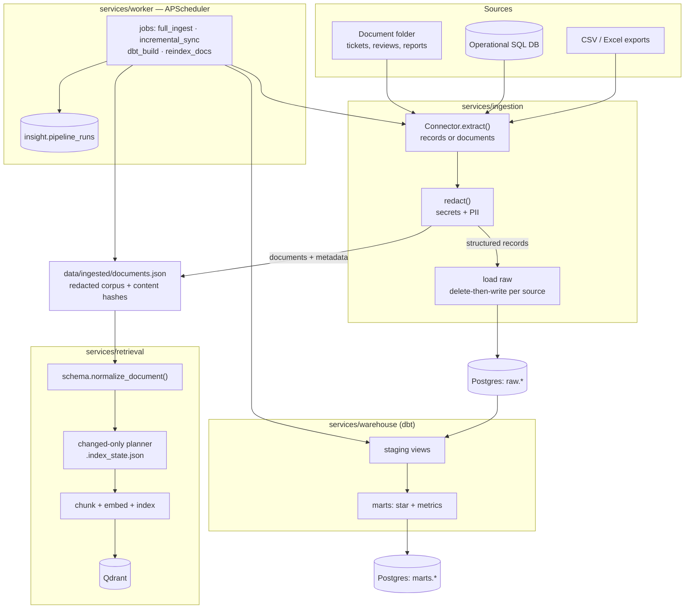

# 03 — Ingestion & ELT

This document describes how data gets **into** InsightGPT: the connectors that
extract it, the redaction that protects it, the raw landing and dbt transform
that model it, the document hand-off to retrieval, and the orchestration that
schedules and tracks it all. It elaborates the Ingestion box of
[`01-architecture.md`](01-architecture.md) §4.1 and feeds the schemas defined in
[`02-data-model.md`](02-data-model.md).

The design deliberately reuses proven practices from `rememory`'s indexer:
content-hash incremental updates, redaction before anything is persisted, and
idempotent delete-then-write so every run is safe to repeat.

## 1. Principle: ELT, not ETL

We **land raw first, then transform in-warehouse** with dbt. The extractor's
only job is to move bytes faithfully into the `raw` schema; all cleaning,
typing, and modeling happens in versioned, testable dbt models
([`00-overview.md`](00-overview.md) §8). This keeps extraction dumb and
re-runnable, and means a transform bug is fixed by re-running dbt rather than
re-pulling every source.

## 2. End-to-end flow



Two branches share one extraction and one redaction pass: structured records
flow to `raw` then dbt; documents are published as one redacted corpus file that
retrieval normalizes, diffs, and indexes (§7). Redaction sits **before** the fork
so neither branch can persist a secret.

## 3. Source connectors

### 3.1 Connector interface

Every source implements one small interface, so adding a source is adding a
class, not editing the pipeline. Config is YAML-driven
([`01-architecture.md`](01-architecture.md) §1), never hardcoded.

```python
class Connector(Protocol):
    name: str                       # stable source id, used as raw table prefix
    kind: Literal["records", "documents"]

    def discover(self) -> list[SourceUnit]:
        """Cheap listing of extractable units (a table, a file, a folder entry)
        with a watermark/content-hash, WITHOUT reading full payloads."""

    def extract(self, unit: SourceUnit) -> Iterator[Record] | Iterator[Document]:
        """Yield rows (records) or documents+metadata for one unit."""

    def fingerprint(self, unit: SourceUnit) -> str:
        """Content hash or watermark used to skip unchanged units."""
```

`SourceUnit` carries `(source, unit_id, fingerprint, updated_at)`. Splitting
`discover()` from `extract()` mirrors rememory's cheapest-first discovery: we
decide *whether* a unit changed before paying to read it.

### 3.2 Concrete connectors

- **CSV / Excel connector** — points at a file or glob. Each file/sheet is a
  `SourceUnit`; `fingerprint` is the SHA-256 of file bytes (rememory's
  `content_hash` idea, see `discovery.py`). Header row → column names; `extract`
  yields dict records. Handles the synthetic exports of customers, products,
  orders, order_items, inventory, stores.
- **SQL database source connector** — reads from the simulated operational
  Postgres/MySQL. Each table is a `SourceUnit`. Two modes: full (`SELECT *`) and
  **incremental** via a `watermark_column` (e.g. `updated_at` or a monotonic
  id) — only rows past the last stored watermark are pulled.
- **Document / folder source connector** (`kind="documents"`) — walks a folder
  of tickets/reviews/reports. Reuses rememory's discovery discipline: prune
  ignored directories, reject by content probe (NUL-byte / non-UTF-8) not just
  extension, skip empty and oversized files, and **hash bytes** for change
  detection. It handles two shapes: a `.json` file holding a list of document
  objects (what the generator writes) yields one document per element; any
  other UTF-8 text file yields one document. Each document carries the
  producer's own metadata (`doc_type`, `created_ts`, `region`, `category`,
  `product_sku`, ...); mapping those onto the canonical payload schema is
  retrieval's job — see §7.

### 3.3 Incremental loading

Two complementary strategies, both borrowed from rememory:

1. **Content hash** — for files and documents: `fingerprint = sha256(bytes)`.
   The stored hash from the last successful run is compared per unit; unchanged
   units are skipped and counted (`skipped_unchanged`), exactly as
   `pipeline.py` skips unchanged files under `only_changed`.
2. **Watermark** — for SQL sources with a reliable `updated_at`/id column: pull
   only rows beyond the high-water mark recorded on the previous run.

A full ingest ignores both and reloads everything (used for seeding and for
recovering from schema changes — the raw table is widened with
`ALTER TABLE ... ADD COLUMN IF NOT EXISTS` for any column the source has
gained, since raw is a landing zone and a source that grew a column must not
break every subsequent load).

**Implemented today:** the content-hash strategy, for the CSV connector (per
file) and the document corpus (per document). The watermark strategy belongs to
the SQL source connector, which is designed in §3.2 but not yet built.

## 4. Redaction at ingestion

Redaction runs **once, before** loading to `raw` and before any text reaches
the embedder — the same placement rememory uses (`redact.py`), for the same
reason: content that never enters a store can never be retrieved back out into a
model's context. It is applied to both structured field values (PII columns) and
document bodies.

**What is redacted:**

- **High-confidence secret token formats** — AWS/GitHub/Slack/Stripe/GCP keys,
  provider API keys, JWTs, and PEM private-key blocks. These are
  format-anchored (they match the secret itself, not a variable name), so they
  run on everything with near-zero false positives. Reused directly from
  rememory's `_TOKEN_PATTERNS`.
- **PII** — email addresses, phone numbers, and card-like number sequences
  (with a Luhn check to cut false positives) in `customers`, `support_tickets`,
  and `reviews`. Full names in known name columns are masked. A short,
  recognizable prefix is preserved (e.g. `****@[REDACTED]`) so a document
  remains *findable* ("where is the customer contact") without exposing the
  value — mirroring rememory's `ghp_[REDACTED]` behavior.

**Credential files are never indexed.** The document connector's discovery
skips `.env`, key files, and anything matching credential filename patterns
outright — they are not landed and not embedded. This is the belt-and-braces
partner to content redaction.

Redaction is **line-count preserving** for documents so chunk offsets and
citation line numbers stay correct, exactly as rememory guarantees. Each run
records a `secrets_redacted` count surfaced in the pipeline monitor.

## 5. Orchestration — APScheduler in the worker

Orchestration is deliberately lightweight: an **APScheduler** instance inside
the `services/worker` FastAPI process, not Airflow/Dagster (rejected as heavy
for scope — [`01-architecture.md`](01-architecture.md) §5). No extra infra, easy
to demo and reason about.

### 5.1 Job types

The four job names are exactly these — `worker.jobs.JOB_NAMES` — and each is
runnable on its own with `python -m worker run <job>`:

| Job | Does | Trigger |
|---|---|---|
| `full_ingest` | Extract → redact → **full** reload of `raw.*` (ignoring stored hashes) and republish the document corpus | On-demand (seed, recovery) |
| `incremental_sync` | Extract → redact → load only units whose content hash changed; republish the document corpus | Every 30 min (`INCREMENTAL_SYNC_MINUTES`) |
| `dbt_build` | `dbt build` (run + test) `staging` → `marts`, shelled out to the `dbt` CLI | Daily at 02:00 (`DBT_BUILD_HOUR` / `DBT_BUILD_MINUTE`) |
| `reindex_docs` | Re-chunk / re-embed **changed** documents from the published corpus into Qdrant | Every 30 min, offset 15 min so it never fires in the same tick as `incremental_sync` |

Jobs are **not** chained to each other today: each is an independent scheduled
trigger, and the offset between the two 30-minute jobs is what keeps them from
contending. Chaining is unnecessary for correctness because each job is
idempotent and gates its own work — `incremental_sync` skips unchanged units,
`reindex_docs` skips unchanged documents, and `dbt_build` rebuilds from whatever
is currently in `raw`. Event-driven chaining is on the roadmap
([`11-roadmap.md`](11-roadmap.md)), not in the code.

### 5.2 Scheduling, retries, backoff

- Schedules are env-configurable interval/cron triggers on a single APScheduler
  instance. Every job is registered with `max_instances=1` and `coalesce=True`,
  which is the single-instance execution lock: a long run cannot overlap itself,
  and missed fires collapse into one catch-up rather than a thundering herd.
- **A failed unit does not abort the run.** One unreadable file, one bad
  document, one row that will not load is recorded and the run continues — like
  `pipeline.py`, so a single malformed record never blocks the batch. A job that
  raises is caught by the run wrapper, recorded as `failed` with the error, and
  the scheduler loop keeps going.
- **Retries** are per-operation where they pay for themselves — bootstrap
  retries a flaky Ollama model pull, for instance — rather than a generic
  backoff wrapper around every job. A failed scheduled job is retried by its
  next fire, which for the 30-minute jobs is soon enough to need no extra
  machinery.

### 5.3 `pipeline_runs` tracking table

Every job execution writes a tracked run, surfaced through the API for the
pipeline-monitor UI ([`01-architecture.md`](01-architecture.md) §4.6).

The table is deliberately narrow — one row per run, with per-unit detail staying
in the job's stats and logs. This is the schema actually in use, created by
`docker/initdb/01-schemas.sql` and re-created defensively by the worker's run
store:

| Column | Type | Meaning |
|---|---|---|
| `id` | text PK | Run id (hex uuid4) |
| `pipeline` | text | `full_ingest` / `incremental_sync` / `dbt_build` / `reindex_docs` |
| `status` | text | `queued` / `running` / `success` / `failed` |
| `started_at`, `finished_at` | timestamptz | → duration |
| `rows_processed` | integer | Rows loaded, or chunks written for `reindex_docs`; null on failure |
| `error` | text | Exception type, message, and traceback, truncated to 4 000 chars |
| `triggered_by` | text | `schedule` / `manual` |
| `created_at` | timestamptz | Row insert time |

The richer per-run counters rememory's `IndexStats` tracks — `units_seen`,
`units_loaded`, `units_skipped`, `units_unchanged`, `rows_loaded`,
`secrets_redacted`, `documents_published`, `documents_changed` — are returned by
`services.ingestion.run()` and printed by its CLI and by `scripts/seed.py`, but
are **not** columns here. The monitor answers "why isn't my data current?" from
`status` + `error` + `rows_processed`; the counters answer "what exactly
happened in that run?" at the command line.

With no `POSTGRES_DSN` the run store keeps records in memory and logs a warning,
so the scheduler and the offline tests run without a database — records are lost
on exit, which the warning says plainly.

## 6. Idempotency and re-runnability

Every load is **delete-then-write per source unit**, so a re-run converges to
the same state instead of duplicating — the exact practice in `pipeline.py`
(`store.delete_file(...)` before `store.upsert(...)`, so a shrunk file leaves no
stale tail):

- **Structured** — for a reloaded unit, delete its existing `raw` rows for that
  `(_source, unit_id)` then insert the fresh batch in one transaction. dbt
  models are `table`/`view` rebuilds, inherently idempotent.
- **Documents** — before re-indexing a changed document, delete its existing
  chunks in Qdrant, then upsert the new ones (rememory's delete-first rule so a
  document that lost content leaves no orphan chunks).

Because extraction is dumb and loads are idempotent, **any job is safe to
re-run** at any time. Interrupted runs leave a consistent (if partial) state,
never a corrupt one.

## 7. Hand-off to retrieval

The document branch does not embed inline; it hands each redacted document plus
its metadata to the retrieval/indexing pipeline, which owns chunking (heading/
section-aware), embedding (local Ollama), sparse-vector construction, and the
Qdrant upsert. That boundary — and the hybrid-search + rerank design on the
query side — is specified in [`04-retrieval-rag.md`](04-retrieval-rag.md).

**The hand-off is a file.** `services/ingestion` publishes every redacted
document to `data/ingested/documents.json` (`IngestionSettings.document_corpus_path`),
and that is exactly the path the worker's `reindex_docs` job and
`insight-retrieval index` read by default. Making the contract a concrete
artifact rather than an in-process call means the ingest and the index can run
in different containers, at different times, and either can be re-run alone.

Three properties make it work:

1. **Redacted before publication.** Redaction runs on extraction, so nothing
   secret is ever written to the corpus file, let alone embedded.
2. **Deterministic and only rewritten when it changed.** Documents are sorted by
   `doc_id` and serialized with sorted keys, then written atomically via a temp
   file and a rename — and skipped entirely when the bytes match what is already
   there. A re-ingest of an unchanged source touches nothing.
3. **Content-hashed per document.** Each record carries a `_content_hash`, which
   gives `incremental_sync` an honest "N documents changed" count.

The ingestion side guarantees only two things to retrieval: the text is already
redacted, and each document carries its filter metadata. It deliberately does
*not* rename fields — the generator's `doc_type` / `created_ts` /
`author_role: support_agent` are published as-is, and `retrieval/schema.py`
normalizes them onto the canonical payload schema
([`04-retrieval-rag.md`](04-retrieval-rag.md) §1.1). One normalizer, owned by
the consumer, is the reason a filter cannot half-match.

**Changed-only indexing.** Retrieval keeps an index-state file beside the corpus
(`.index_state.json`) mapping `doc_id` to the hash of the canonical content it
last embedded, keyed by collection name. A reindex re-embeds only documents
whose hash changed, and **deletes** the chunks of documents that vanished from
the corpus — so a retracted ticket stops being retrievable instead of lingering
forever. `insight-retrieval index --full` ignores the state and re-embeds
everything.

## 8. Operational commands

Illustrative CLI/`make` targets (exact wiring in `scripts/`):

```bash
# Seed the whole demo: generate -> load raw + publish documents -> dbt
python scripts/seed.py

# Full ingest of all sources into raw.* (records) + publish the document corpus
python -m services.ingestion run --job full_ingest --source all

# Incremental sync (content hash) of just the document branch
python -m services.ingestion run --job incremental_sync --source documents

# Transform + test the warehouse (staging -> marts + semantic metrics)
dbt build --project-dir services/warehouse --profiles-dir services/warehouse

# Re-chunk + re-embed changed documents into Qdrant
insight-retrieval index            # changed-only, from the published corpus
insight-retrieval index --full     # re-embed everything

# The same work, run as a TRACKED job (writes a pipeline_runs row)
python -m worker run full_ingest
python -m worker run incremental_sync
python -m worker run dbt_build
python -m worker run reindex_docs
```

Every command is re-runnable (§6). The `python -m worker run <job>` form is the
one that records a `pipeline_runs` row (§5.3) and exits non-zero when the run
failed; calling the services directly does not, which is what makes them usable
as plain command-line tools.

## 9. Where to go next

- The schemas these jobs populate → [`02-data-model.md`](02-data-model.md)
- Retrieval/indexing that consumes the document hand-off → [`04-retrieval-rag.md`](04-retrieval-rag.md)
- How runs are exposed via the API/monitor → [`06-api.md`](06-api.md)
