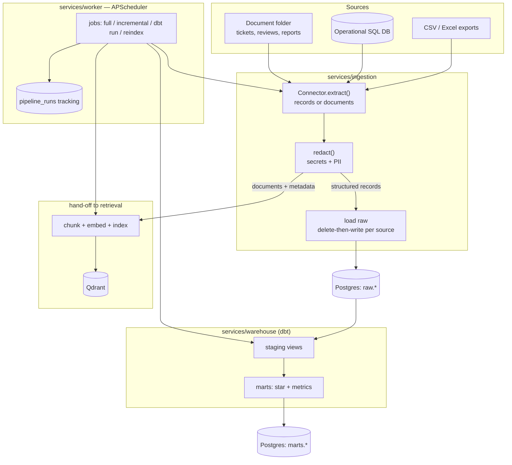

# 03 — Ingestion & ELT

This document describes how data gets **into** InsightGPT: the connectors that
extract it, the redaction that protects it, the raw landing and dbt transform
that model it, the document hand-off to retrieval, and the orchestration that
schedules and tracks it all. It elaborates the Ingestion box of
[`01-architecture.md`](01-architecture.md) §4.1 and feeds the schemas defined in
[`02-data-model.md`](02-data-model.md).

The design deliberately reuses proven practices from `rememory`'s indexer:
content-hash incremental updates, redaction before anything is persisted, and
idempotent delete-then-write so every run is safe to repeat.

## 1. Principle: ELT, not ETL

We **land raw first, then transform in-warehouse** with dbt. The extractor's
only job is to move bytes faithfully into the `raw` schema; all cleaning,
typing, and modeling happens in versioned, testable dbt models
([`00-overview.md`](00-overview.md) §8). This keeps extraction dumb and
re-runnable, and means a transform bug is fixed by re-running dbt rather than
re-pulling every source.

## 2. End-to-end flow



Two branches share one extraction and one redaction pass: structured records
flow to `raw` then dbt; documents flow to chunking/indexing. Redaction sits
**before** the fork so neither branch can persist a secret.

## 3. Source connectors

### 3.1 Connector interface

Every source implements one small interface, so adding a source is adding a
class, not editing the pipeline. Config is YAML-driven
([`01-architecture.md`](01-architecture.md) §1), never hardcoded.

```python
class Connector(Protocol):
    name: str                       # stable source id, used as raw table prefix
    kind: Literal["records", "documents"]

    def discover(self) -> list[SourceUnit]:
        """Cheap listing of extractable units (a table, a file, a folder entry)
        with a watermark/content-hash, WITHOUT reading full payloads."""

    def extract(self, unit: SourceUnit) -> Iterator[Record] | Iterator[Document]:
        """Yield rows (records) or documents+metadata for one unit."""

    def fingerprint(self, unit: SourceUnit) -> str:
        """Content hash or watermark used to skip unchanged units."""
```

`SourceUnit` carries `(source, unit_id, fingerprint, updated_at)`. Splitting
`discover()` from `extract()` mirrors rememory's cheapest-first discovery: we
decide *whether* a unit changed before paying to read it.

### 3.2 Concrete connectors

- **CSV / Excel connector** — points at a file or glob. Each file/sheet is a
  `SourceUnit`; `fingerprint` is the SHA-256 of file bytes (rememory's
  `content_hash` idea, see `discovery.py`). Header row → column names; `extract`
  yields dict records. Handles the synthetic exports of customers, products,
  orders, order_items, inventory, stores.
- **SQL database source connector** — reads from the simulated operational
  Postgres/MySQL. Each table is a `SourceUnit`. Two modes: full (`SELECT *`) and
  **incremental** via a `watermark_column` (e.g. `updated_at` or a monotonic
  id) — only rows past the last stored watermark are pulled.
- **Document / folder source connector** (`kind="documents"`) — walks a folder
  of tickets/reviews/reports. Reuses rememory's discovery discipline: prune
  ignored directories, reject by content probe (NUL-byte / non-UTF-8) not just
  extension, skip empty and oversized files, and **hash bytes** for change
  detection. Each document yields text plus structured metadata
  (`product_id`, `region`, `created_ts`, `doc_type`) for retrieval filtering.

### 3.3 Incremental loading

Two complementary strategies, both borrowed from rememory:

1. **Content hash** — for files and documents: `fingerprint = sha256(bytes)`.
   The stored hash from the last successful run is compared per unit; unchanged
   units are skipped and counted (`skipped_unchanged`), exactly as
   `pipeline.py` skips unchanged files under `only_changed`.
2. **Watermark** — for SQL sources with a reliable `updated_at`/id column: pull
   only rows beyond the high-water mark recorded on the previous run.

A full ingest ignores both and reloads everything (used for seeding and for
recovering from schema changes).

## 4. Redaction at ingestion

Redaction runs **once, before** loading to `raw` and before any text reaches
the embedder — the same placement rememory uses (`redact.py`), for the same
reason: content that never enters a store can never be retrieved back out into a
model's context. It is applied to both structured field values (PII columns) and
document bodies.

**What is redacted:**

- **High-confidence secret token formats** — AWS/GitHub/Slack/Stripe/GCP keys,
  provider API keys, JWTs, and PEM private-key blocks. These are
  format-anchored (they match the secret itself, not a variable name), so they
  run on everything with near-zero false positives. Reused directly from
  rememory's `_TOKEN_PATTERNS`.
- **PII** — email addresses, phone numbers, and card-like number sequences
  (with a Luhn check to cut false positives) in `customers`, `support_tickets`,
  and `reviews`. Full names in known name columns are masked. A short,
  recognizable prefix is preserved (e.g. `****@[REDACTED]`) so a document
  remains *findable* ("where is the customer contact") without exposing the
  value — mirroring rememory's `ghp_[REDACTED]` behavior.

**Credential files are never indexed.** The document connector's discovery
skips `.env`, key files, and anything matching credential filename patterns
outright — they are not landed and not embedded. This is the belt-and-braces
partner to content redaction.

Redaction is **line-count preserving** for documents so chunk offsets and
citation line numbers stay correct, exactly as rememory guarantees. Each run
records a `secrets_redacted` count surfaced in the pipeline monitor.

## 5. Orchestration — APScheduler in the worker

Orchestration is deliberately lightweight: an **APScheduler** instance inside
the `services/worker` FastAPI process, not Airflow/Dagster (rejected as heavy
for scope — [`01-architecture.md`](01-architecture.md) §5). No extra infra, easy
to demo and reason about.

### 5.1 Job types

| Job | Does | Typical trigger |
|---|---|---|
| `full_ingest` | Extract → redact → **full** reload of `raw.*` for a source; reset watermarks/hashes | On-demand (seed, recovery) |
| `incremental_sync` | Extract only changed units (hash/watermark) → redact → upsert `raw.*` | Scheduled (e.g. hourly) |
| `dbt_run` | `dbt build` (run + test) `staging` → `marts` | After an ingest completes |
| `reindex` | Re-chunk/re-embed changed documents into Qdrant | After a document ingest; or on-demand |

Jobs are chained: a successful incremental_sync of a records source enqueues a
`dbt_run`; a document ingest enqueues `reindex`. Chaining is explicit so a
partial failure does not silently publish a half-built mart.

### 5.2 Scheduling, retries, backoff

- Schedules are config-driven cron/interval triggers (e.g. incremental_sync
  every hour, a nightly full dbt_run). A single-instance execution lock per job
  type prevents overlapping runs — the same concern rememory's writer heartbeat
  solves for its indexer.
- **Retries with exponential backoff** on transient failures (source
  unreachable, DB contention): bounded attempts, growing delay, then the run is
  marked `failed` with the error captured. A failed unit does not abort the
  whole run — like `pipeline.py`, one bad file/row is recorded and the run
  continues, so a single malformed record never blocks the batch.

### 5.3 `pipeline_runs` tracking table

Every job execution writes a tracked run, surfaced through the API for the
pipeline-monitor UI ([`01-architecture.md`](01-architecture.md) §4.6).

| Column | Meaning |
|---|---|
| `run_id` | PK |
| `job_type` | full_ingest / incremental_sync / dbt_run / reindex |
| `source` | source name (null for dbt_run) |
| `status` | queued / running / success / failed / partial |
| `started_at`, `finished_at` | timestamps → duration |
| `units_seen`, `units_loaded`, `units_skipped`, `units_failed` | counts |
| `rows_loaded`, `secrets_redacted`, `chunks_indexed` | volume/redaction stats |
| `error` | first error + truncated detail on failure |
| `triggered_by` | schedule / manual / chained |

These counters are the same honest-reporting stats rememory's `IndexStats`
tracks (`files_seen`, `files_skipped_unchanged`, `files_failed`,
`secrets_redacted`), lifted to the pipeline level. The monitor answers "why
isn't my data current?" the way rememory's `--explain` answers "why isn't my
file indexed?".

## 6. Idempotency and re-runnability

Every load is **delete-then-write per source unit**, so a re-run converges to
the same state instead of duplicating — the exact practice in `pipeline.py`
(`store.delete_file(...)` before `store.upsert(...)`, so a shrunk file leaves no
stale tail):

- **Structured** — for a reloaded unit, delete its existing `raw` rows for that
  `(_source, unit_id)` then insert the fresh batch in one transaction. dbt
  models are `table`/`view` rebuilds, inherently idempotent.
- **Documents** — before re-indexing a changed document, delete its existing
  chunks in Qdrant, then upsert the new ones (rememory's delete-first rule so a
  document that lost content leaves no orphan chunks).

Because extraction is dumb and loads are idempotent, **any job is safe to
re-run** at any time. Interrupted runs leave a consistent (if partial) state,
never a corrupt one.

## 7. Hand-off to retrieval

The document branch does not embed inline; it hands each redacted document plus
its metadata to the retrieval/indexing pipeline, which owns chunking (heading/
section-aware), embedding (local Ollama), sparse-vector construction, and the
Qdrant upsert. That boundary — and the hybrid-search + rerank design on the
query side — is specified in [`04-retrieval-rag.md`](04-retrieval-rag.md). The
ingestion side guarantees only two things to retrieval: the text is already
redacted, and each document carries stable filter metadata (`doc_type`,
`product_id`, `region`, `created_ts`).

## 8. Operational commands

Illustrative CLI/`make` targets (exact wiring in `scripts/`):

```bash
# Seed the synthetic demo dataset (generates CSVs + documents into data/)
python scripts/seed_demo_data.py

# Full ingest of all configured sources into raw.* (records) + redacted docs
python -m services.ingestion run --job full_ingest --source all

# Incremental sync (hash/watermark) of a single source
python -m services.ingestion run --job incremental_sync --source operational_db

# Transform + test the warehouse (staging -> marts + semantic metrics)
dbt build --project-dir services/warehouse

# Re-chunk + re-embed changed documents into Qdrant
python -m services.retrieval reindex --changed-only
```

All commands are re-runnable (§6) and every invocation records a `pipeline_runs`
row (§5.3).

## 9. Where to go next

- The schemas these jobs populate → [`02-data-model.md`](02-data-model.md)
- Retrieval/indexing that consumes the document hand-off → [`04-retrieval-rag.md`](04-retrieval-rag.md)
- How runs are exposed via the API/monitor → [`06-api.md`](06-api.md)
