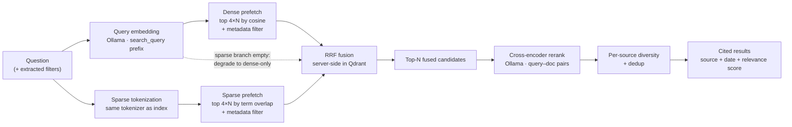

# 04 — Retrieval / RAG

This document covers the **unstructured** half of InsightGPT: how business
documents are indexed and retrieved so the insight engine can answer questions
grounded in real text with citations. The structured half (text-to-SQL over the
warehouse) is [`05-insight-engine.md`](05-insight-engine.md); how the two are
combined into one answer is also there.

The retrieval design is lifted, almost verbatim in shape, from `rememory`'s
production retrieval pipeline: **hybrid dense + sparse search, server-side RRF
fusion in Qdrant, cross-encoder reranking, per-source diversity, local Ollama
models**. Where rememory retrieves code and docs for an assistant, InsightGPT
retrieves support tickets, reviews, and reports for an analyst. The mechanics
are the same; the payload schema and the diversity key differ.

Related docs:

- Ingestion, connectors, and **redaction** (which runs before anything reaches
  this pipeline) → [`03-ingestion-etl.md`](03-ingestion-etl.md)
- Data model / warehouse (structured data lives here, **not** in Qdrant) →
  [`02-data-model.md`](02-data-model.md)
- Security, prompt-injection handling, allow-lists → [`08-security.md`](08-security.md)
- Retrieval evaluation harness → [`10-testing-eval.md`](10-testing-eval.md)

---

## 1. What gets indexed

InsightGPT indexes the organization's **unstructured business text** — the
material that never fits cleanly into a warehouse table but carries the *why*
behind the numbers.

| Document type | Source | Typical question it answers |
|---|---|---|
| **Support tickets** | Helpdesk export (CSV/JSON), one record per ticket | "What are customers complaining about this month?" |
| **Product reviews** | Store/marketplace export, one record per review | "Why are reviews for the X230 trending negative?" |
| **Reports / internal emails** | Markdown/PDF/`.eml`, long-form, multi-section | "What did the Q2 ops review say about fulfilment delays?" |

Structured facts (orders, revenue, inventory) are deliberately **out of scope
for retrieval** — they live in Postgres and are answered by governed SQL. Qdrant
holds only document text and its metadata. This separation is a hard design
line: it keeps numeric answers exact and auditable (SQL, not vector similarity)
and keeps retrieval focused on language.

### 1.1 Metadata (payload) schema

Every chunk stored in Qdrant carries a payload used for **filtering**,
**citation**, and **diversity**. Producers disagree on field names — the
generator writes `doc_type` / `created_ts` / `author_role: support_agent`, the
built-in sample set writes `source_type` / `date` / `author_role: agent` — so a
single normalizer, `retrieval/schema.py`, maps every producer onto the table
below before anything is indexed. A filter therefore works identically across
document types and across corpora.

| Field | Type | Purpose |
|---|---|---|
| `doc_id` | string | Stable id of the source document (for delete-then-write, citations) |
| `source_type` | enum `ticket \| review \| report \| email` | Filter + per-source diversity key |
| `title` | string | Human-readable citation label |
| `created_at` | ISO-8601 date/timestamp | Date-range filtering ("this month"), recency |
| `product_ref` | string \| null | SKU the document is about (falls back to the product id) |
| `order_ref` | string \| null | Order id, when the document references one |
| `author_role` | enum `customer \| agent \| manager` | Scope who is speaking (complaint vs. resolution) |
| `region` / `category` | string \| null | The engine's two entity filters; must match the warehouse's dimension values |
| `channel` | string \| null | e.g. email, web, phone — provenance |
| `chunk_index` / `chunk_total` | int | Position within the document (context expansion) |
| `heading_path` | string \| null | Breadcrumb for report sections (see §2) |
| `indexed_at` / `schema_version` | string / int | When the point was written, under which payload contract |
| `content` | string | The chunk text actually shown/quoted |

Keyword payload indexes exist for `source_type`, `region`, `category`,
`product_ref`, `order_ref`, and `author_role`; `created_at` gets a datetime
index. Only those need an index — an unindexed field is still stored and still
returned, it just cannot be filtered on.

`author_role` is a **closed** enum, normalized from whatever the producer wrote.
An un-normalized `support_agent` would not error; it would simply never match
`author_role = "agent"`, and the question "what did agents say?" would come back
empty. `region` and `category` matter for the same reason: they are the two
filters the insight engine attaches when it scopes retrieval to a declining
segment, and their values must be the ones the warehouse dimensions use.

`product_ref` and `order_ref` are the join keys that let a hybrid question line
up document evidence with warehouse rows ("the SKUs whose revenue fell *and*
whose reviews turned negative"). The generator names the SKU in the document
text as well as in the metadata, so the sparse half of hybrid search can match
it exactly.

---

## 2. Chunking strategy

Retrieval quality is decided at chunk time, not query time: a chunk is the unit
that gets embedded, retrieved, reranked, and cited. InsightGPT uses **two
chunkers**, chosen by document type — the same split rememory makes between its
heading-aware docs chunker and its record-level content.

### 2.1 Records: whole-record chunking (tickets, reviews)

A support ticket or a product review is already a self-contained thought,
usually a few hundred characters. Splitting it would scatter a single complaint
across chunks and destroy citations. So **one record → one chunk**, with the
metadata (§1.1) attached. Only a pathologically long record (a ticket with a
giant pasted log) is windowed, and then with overlap so no sentence is cut.

### 2.2 Reports/emails: heading/section-aware chunking

Long documents are chunked on their **structure** — Markdown/PDF headings,
email sections — so each chunk is a coherent section rather than an arbitrary
character window. This is rememory's `DocsChunker` idea directly: split on
heading boundaries, keep sections whole up to a max size, window only when a
single section is too large.

### 2.3 Breadcrumb / context headers

A bare chunk often lacks the vocabulary that makes it findable. rememory's
insight — *"`def allow(self, key)` does not mention rate limiting, but
`services/rate_limit.py :: LeakyBucket.allow` does"* — applies just as well to a
report section titled "Root cause" that never repeats the word "fulfilment".

So before embedding, each chunk is prefixed with a **breadcrumb header** built
from its provenance:

```
Q2 Operations Review :: Fulfilment › Root cause
2026-05-14 · report · manager
<chunk text…>
```

The header is prepended to the **embedded text and the sparse tokenization
only** — never to the stored `content` that gets quoted back to the user. This
supplies the missing vocabulary (document title, section path, date, source
type) to both the dense and sparse representations without polluting citations.
It is exactly rememory's `header_for` / `embed_text` split.

### 2.4 Redaction happens first

Secrets and PII are redacted **before chunking, embedding, or storage** — see
[`03-ingestion-etl.md`](03-ingestion-etl.md). A credential or a customer's card
number that never enters Qdrant can never be retrieved into an LLM prompt (and
from there into a transcript that leaves the machine). This mirrors rememory's
`redact()`-before-`chunk()` ordering in `pipeline.py`, and it is why redaction
is an ingestion concern, not a retrieval one.

---

## 3. Embedding & storage

### 3.1 Embeddings via Ollama (local, batched)

Chunks are embedded with a **local Ollama embedding model** — CPU-viable and
private, no data leaves the box. The model is configurable in
`services/retrieval/config/retrieval.yaml`; the shipped default is
**`nomic-embed-text`, 768-dimensional, cosine distance** (overridable with the
`EMBED_MODEL` environment variable). Documents are embedded in **batches** of 32
rather than one call per chunk, which is the dominant cost in indexing.

Query and document use asymmetric prefixes — `search_query: ` and
`search_document: ` — so the same text embeds differently as a question vs. as
a passage. Both prefixes live in the same config block as the model name, so no
caller can pair the wrong ones. The query-side builder uses the **same model and
prefixes** as indexing; a mismatch degrades retrieval silently rather than
erroring, which is why changing the model or its dimensions requires a **full
re-index**, not a restart.

### 3.2 Qdrant: dense + sparse vectors

Each point in Qdrant carries **two vectors**:

- a **dense** vector (`dense`) — the Ollama embedding, for semantic similarity;
- a **sparse** vector (`lexical`) — term-frequency style, built by a
  deterministic tokenizer (rememory's CRC32 hashing + identifier splitting) for
  exact-term matching.

Both are built from the **same header-prefixed text**, so a search that keys on
an exact SKU or an order id matches lexically while a paraphrased complaint
matches semantically. Why both: dense answers "what is this about?" but blurs
exact strings; sparse nails exact strings but misses paraphrase. Business
questions need both at once ("orders" the concept vs. `ORD-88213` the literal).

### 3.3 Deterministic IDs, delete-then-write

Point ids are **deterministic** — a UUID5 of `doc_id : chunk_index` — so
re-indexing a document overwrites its own chunks instead of duplicating them.
Each document is written **delete-then-write**: all existing chunks for a
`doc_id` are deleted, then the current chunks are upserted. This is rememory's
`store.delete_file(...)` → `store.upsert(...)` per-file pattern, and it matters
for the same reason: a document that **shrank** (a ticket edited down, a report
section removed) would otherwise leave stale tail chunks that nothing
overwrites, and searches would return deleted text forever.

Indexing is **per-document and idempotent**: an interrupted re-index leaves a
partially-updated but internally consistent collection, because each document is
all-or-nothing.

---

## 4. Query-time pipeline

The retrieval pipeline is a **two-stage** design: a wide, cheap first stage for
recall (hybrid + RRF) and a precise, expensive second stage for precision
(cross-encoder rerank), followed by diversity/dedup. This mirrors
`rememory/memory_mcp/search.py` one-for-one.



Step by step:

1. **Query embed + sparse tokenize.** The question is embedded (dense) and
   tokenized (sparse) with the *same* models/tokenizer used at index time.
2. **Dense & sparse prefetch.** Each branch fetches `4 × N` candidates
   (rememory's `PREFETCH_MULTIPLIER = 4`). Over-fetching lets a hit that is
   mediocre in one branch but strong in the other survive fusion.
3. **RRF fusion (server-side).** Qdrant fuses the two ranked lists with
   **Reciprocal Rank Fusion**. RRF scores by **rank**, not raw score — which is
   essential because cosine similarity and sparse term scores live on
   incomparable scales; rank is the only thing they share.
4. **Cross-encoder rerank.** The fused top-N are re-scored by a local
   cross-encoder that reads the **query and document together** and judges
   *answerhood*, not mere similarity. This is dramatically more accurate and
   slower — hence its place as stage two over a small candidate set. Model is
   configurable (rememory's reference is a small Qwen3-Reranker scored via
   Ollama logprobs).
5. **Per-source diversity / dedup.** Results are capped per source so one
   loud document (or one duplicated review) cannot monopolize the list;
   near-duplicates are dropped. See §5.
6. **Results with citations.** Each result carries its `source_type`, `title`,
   `created_at`, and a **relevance score**, so the engine (and the UI) can cite
   and rank transparently.

### 4.1 Graceful degradation

Every stage is defensive, exactly as in rememory:

- The **sparse branch can fail** on an empty-vocabulary query (e.g. all
  stopwords). The pipeline catches it and **degrades to dense-only** rather than
  erroring the request.
- **Reranking is an enhancement, never a dependency.** If the reranker model is
  missing, times out, or exceeds its batch budget, it logs and returns the
  **RRF order** untouched. A search must never fail because its second stage
  did. A hard failure (model not pulled) disables reranking for the process
  lifetime so it does not add a timeout to every subsequent query.

---

## 5. Per-source diversity & dedup

rememory caps chunks **per file** so one file cannot crowd out the second-best
*place to look*. InsightGPT caps per **source document / source type** instead:
the diversity key is `doc_id` (and secondarily `source_type`). Concretely:

- Cap chunks per source document (e.g. `max_per_doc = 2`) so a single long
  report cannot fill the whole result window.
- Backfill from the overflow so the caller still receives `N` results when
  possible — rememory's diverse-then-overflow slice.
- For "top themes" style questions, optionally balance across `source_type` so
  the answer draws on tickets *and* reviews rather than whichever happens to
  rank highest.

The effect: a "summarize complaints" answer quotes *many customers*, not the
same verbose ticket five times.

---

## 6. Metadata filtering

Filters are applied **inside** the Qdrant prefetch (attached to both the dense
and sparse branches), not after retrieval — so the `4 × N` candidate budget is
spent only on documents that already match the scope. rememory builds these as
`FieldCondition`s (`MatchValue` for scalars, `MatchAny` for lists); InsightGPT
uses the same construction.

The NL router ([`05-insight-engine.md`](05-insight-engine.md)) extracts scope
from the question and passes it as filters:

| Question phrase | Filter |
|---|---|
| "complaints **this month**" | `created_at` in `[2026-08-01, 2026-08-31]` |
| "reviews for the **X230**" | `product_ref = "X230"` |
| "**support tickets** about refunds" | `source_type = "ticket"` |
| "what **customers** said" (not agents) | `author_role = "customer"` |

Date-range scoping is what makes "*this* month" honest: the retrieval set is
bounded to the period before ranking, so a recency word in the question becomes
a hard filter, not a soft hope.

---

## 7. Collections design in Qdrant

InsightGPT uses a single primary collection:

- **`documents`** — all indexed tickets, reviews, reports, and emails, each
  point carrying dense + sparse vectors and the §1.1 payload. Document type is a
  **payload field** (`source_type`), not a separate collection, so a single
  query can span types or filter to one — cheaper and more flexible than
  per-type collections.

Notably **absent**: any collection for structured data. Orders, revenue, and
inventory are **not** embedded — they live in Postgres and are queried with
governed SQL. Qdrant is for language; Postgres is for numbers. (rememory splits
`code` / `docs` / `memory` collections because those are genuinely different
retrieval domains; InsightGPT's documents are one domain, so one collection with
a type field is the right granularity.)

Collection config (vector size, distance metric, sparse index) is declared in
`services/retrieval/config/retrieval.yaml` and created idempotently at setup,
matching rememory's `collections.yaml` approach — no hardcoded dimensions.
`ensure_collection()` also refuses to proceed when an existing collection's
vector size differs from the configured model's: Qdrant cannot resize in place,
and silently querying 768-d vectors against a 1024-d collection returns
nonsense rather than an error.

---

## 8. Retrieval evaluation

Retrieval quality is **measured, not asserted** (a project-wide success
criterion — see [`00-overview.md`](00-overview.md) §7). The harness uses a
**golden set**: a curated list of `question → expected-document(s)` pairs drawn
from the demo corpus.

Metrics tracked per change:

- **Recall@k / Hit@k** — is the expected document in the top *k*?
- **MRR** — how high does the first correct document rank?
- **Rerank lift** — the same metrics with reranking on vs. off, to justify the
  second stage's cost.

There are two golden sets, because there are two indexable corpora:
`insight-retrieval eval` scores the **generated corpus** (judging hits by
`region` / `category` metadata, since its document ids are sequential and
carry no meaning), and `insight-retrieval eval --samples` scores the six
built-in demo documents by id. Both need a live Qdrant + Ollama and an index
built from the matching corpus; the offline unit tests cover the pure
components (chunking, fusion, sparse tokenization, filter building, the
schema normalizer, and changed-only planning). Full harness, fixtures, and
thresholds: [`10-testing-eval.md`](10-testing-eval.md).

---

## 9. Rejected alternatives

Recorded so reviewers see the reasoning, not just the result (a rememory
practice).

| Decision | Chosen | Rejected | Why |
|---|---|---|---|
| Vector store | **Qdrant, dense + sparse** | pgvector | Weaker native hybrid + rerank ergonomics; Qdrant does RRF server-side and is already the rememory-proven choice |
| Search type | **Hybrid (dense + sparse)** | Dense-only | Dense blurs exact SKUs/order ids; sparse alone misses paraphrase — business text needs both |
| Fusion | **Server-side RRF** | Client-side weighted score blend | Cosine and sparse scores are on incomparable scales; rank-based RRF avoids fragile hand-tuned weights |
| Second stage | **Cross-encoder rerank** | Trust first-stage order | Bi-encoder measures similarity, not answerhood; rerank restores precision on the top-N cheaply |
| Structured data | **Stays in Postgres** | Embed rows into Qdrant | Numeric answers must be exact and auditable (SQL), not approximated by similarity |
| Collections | **One `documents` collection + `source_type` field** | One collection per document type | A single query spans/filters types; avoids cross-collection fan-out for hybrid questions |
| Chunk unit | **Whole-record for tickets/reviews** | Fixed-size windows everywhere | A record is one thought; windowing scatters complaints and breaks citations |

---

## 10. Where to go next

- How retrieved context is **combined with SQL** into one cited answer →
  [`05-insight-engine.md`](05-insight-engine.md)
- Why retrieved text is treated as **untrusted data** (prompt injection) →
  [`08-security.md`](08-security.md)
- The ingestion/redaction that feeds this pipeline →
  [`03-ingestion-etl.md`](03-ingestion-etl.md)
