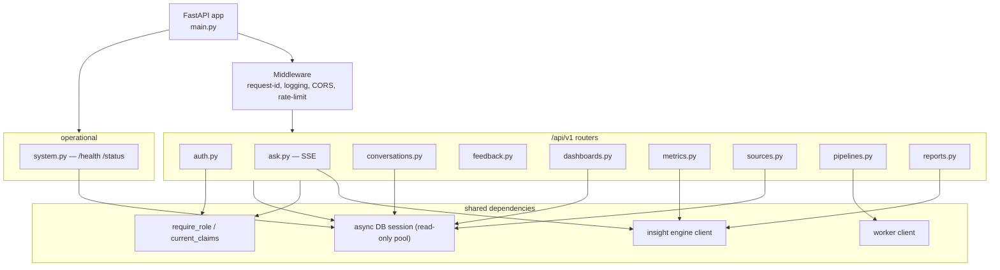

# 06 — API

The API is the single front door to the insight engine, the warehouse, the
document index, and the pipeline worker. It is a **FastAPI** application
(Python 3.12, async, pydantic v2) that exposes REST for command/query work and
**SSE** for streamed answers. This document is the contract: principles, auth,
the endpoint catalog, the streaming protocol, the answer envelope, and the
observability that makes every response explainable.

Upstream context: [`01-architecture.md`](01-architecture.md) (§4.5) and the
insight engine in [`05-insight-engine.md`](05-insight-engine.md). The client of
this contract is [`07-frontend.md`](07-frontend.md).

## 1. Design principles

1. **Typed end to end.** Every request and response is a pydantic model. The
   OpenAPI schema is generated, not hand-written, and is the source the typed
   frontend client is generated from.
2. **Versioned.** All application routes live under `/api/v1`. Breaking changes
   ship under `/api/v2`; `v1` is frozen once published. Unversioned paths
   (`/health`, `/status`) are operational, not application, surface.
3. **Consistent error envelope.** Every non-2xx response is the same shape
   (§5), so the client has exactly one error path to handle.
4. **Request IDs everywhere.** Every request carries an `X-Request-ID`
   (accepted from the caller or minted), echoed on the response and threaded
   through logs and LLM traces (§9).
5. **Grounded, not guessing.** The API never exposes free-form SQL execution.
   Analytical reads go through the governed metric layer or the guarded
   text-to-SQL path; both run under a read-only role.
6. **Stateless request handling.** Auth is a bearer token, not a server
   session. Horizontal scaling needs no sticky routing.

## 2. Auth & authorization

### 2.1 JWT: access + refresh

Authentication is JWT bearer tokens with a short-lived **access** token and a
longer-lived **refresh** token.

| Token | Lifetime (default) | Carries | Used for |
|---|---|---|---|
| Access | 15 min | `sub`, `role`, `exp`, `iat`, `jti` | Every API call, as `Authorization: Bearer <token>` |
| Refresh | 7 days | `sub`, `jti`, `exp` | Minting a new access token at `/api/v1/auth/refresh` |

```python
class TokenPair(BaseModel):
    access_token: str
    refresh_token: str
    token_type: Literal["bearer"] = "bearer"
    expires_in: int  # access-token TTL in seconds

class TokenClaims(BaseModel):
    sub: str                       # user id
    role: Literal["admin", "analyst", "viewer"]
    jti: str                       # token id (for revocation)
    iat: int
    exp: int
```

Auth endpoints:

| Method | Path | Purpose |
|---|---|---|
| POST | `/api/v1/auth/login` | Exchange credentials for a `TokenPair` |
| POST | `/api/v1/auth/refresh` | Exchange a refresh token for a new access token |
| POST | `/api/v1/auth/logout` | Revoke the current refresh token (`jti` denylist) |
| GET | `/api/v1/auth/me` | Return the current `User` (id, email, role) |

Passwords are stored as Argon2 hashes. Refresh tokens are revocable via a `jti`
denylist checked on refresh.

### 2.2 Roles & permissions matrix

Three roles, additive in capability (`viewer` ⊂ `analyst` ⊂ `admin`).

| Capability | viewer | analyst | admin |
|---|:--:|:--:|:--:|
| Ask questions (`/ask`), read own conversations | ✅ | ✅ | ✅ |
| Read dashboards & governed metrics | ✅ | ✅ | ✅ |
| Submit feedback | ✅ | ✅ | ✅ |
| Reveal SQL / citations on an answer | ✅ | ✅ | ✅ |
| Run ad-hoc governed metric queries (`/metrics/query`) | — | ✅ | ✅ |
| Generate & export executive reports | — | ✅ | ✅ |
| View pipelines & run history | — | ✅ | ✅ |
| Trigger a pipeline run | — | — | ✅ |
| Create / test / delete data sources | — | — | ✅ |
| View `/status` service internals | — | — | ✅ |

### 2.3 How roles gate endpoints

Authorization is a FastAPI dependency, not scattered `if` checks. A
`require_role(min_role)` dependency decodes the token, validates it, and
compares the caller's role against the endpoint's minimum on an ordered
enum. Failures are uniform:

- **401 `unauthorized`** — missing/expired/invalid token.
- **403 `forbidden`** — valid token, insufficient role.

```python
def require_role(minimum: Role):
    async def dep(claims: TokenClaims = Depends(current_claims)) -> TokenClaims:
        if claims.role < minimum:            # Role is an ordered IntEnum
            raise ForbiddenError(required=minimum, actual=claims.role)
        return claims
    return dep

@router.post("/pipelines/{name}/run")
async def run_pipeline(name: str, _=Depends(require_role(Role.admin))): ...
```

Row-level scoping (a viewer sees only their own conversations) is enforced in
the query layer using `claims.sub`, independent of the role gate.

## 3. Endpoint catalog

All paths below are relative to `/api/v1`. Every endpoint returns the error
envelope (§5) on failure and echoes `X-Request-ID`.

### 3.1 Ask / insights

#### `POST /ask` — ask a question (SSE stream)

The primary endpoint. Accepts a natural-language question and streams the
answer as Server-Sent Events (§6). Non-streaming clients may send
`Accept: application/json` to receive the assembled envelope in one response.

```python
class AskRequest(BaseModel):
    question: str = Field(min_length=1, max_length=2000)
    conversation_id: str | None = None   # continue a thread, else new
    stream: bool = True                  # SSE vs. single JSON envelope

# Response: text/event-stream (see §6) or a single AnswerEnvelope (§7)
```

#### `GET /conversations` — list the caller's conversations

```python
class ConversationSummary(BaseModel):
    id: str
    title: str                 # derived from the first question
    created_at: datetime
    updated_at: datetime
    message_count: int

class Paginated[T](BaseModel):
    items: list[T]
    total: int
    limit: int
    offset: int
# GET /conversations?limit=20&offset=0 -> Paginated[ConversationSummary]
```

#### `GET /conversations/{id}` — full transcript

Returns the ordered turns, each with its stored `AnswerEnvelope` so the SQL,
citations, and chart can be re-rendered without re-running the query. 404 if
the conversation is not owned by the caller.

#### `PATCH /conversations/{id}` — rename a conversation

```python
class RenameConversationRequest(BaseModel):
    title: str = Field(min_length=1, max_length=120)
# -> 200 ConversationSummary
```

The server collapses whitespace and trims. A whitespace-only title is a `400`
(it would leave an unclickable blank row in the sidebar); over 120 characters is
a `422` naming `body.title`, rejected rather than truncated so the client is
told why.

A renamed conversation is marked as user-titled, so a later turn on that thread
never overwrites the chosen name with one derived from the first question.
`updated_at` is deliberately **not** bumped: it records the last *turn*, which
is what the sidebar orders by, and renaming a thread should not jump it to the
top.

#### `DELETE /conversations/{id}` — remove a conversation

Deletes the conversation and its turns. Returns `200 {"status": "deleted",
"id": ...}`, matching `DELETE /sources/{id}`. Not idempotent: a second delete is
a `404`.

Both mutations are keyed by `(user_id, conversation_id)` exactly like the read
path, so a conversation belonging to another user is **404, not 403** — a `403`
would confirm the id exists and make ids probeable.

#### `POST /feedback` — thumbs / correction on an answer

```python
class FeedbackRequest(BaseModel):
    message_id: str
    rating: Literal["up", "down"]
    reason: str | None = Field(default=None, max_length=1000)
# -> 202 Accepted { "status": "recorded" }
```

Feedback is written to the eval store; it feeds the offline quality harness in
[`10-testing-eval.md`](10-testing-eval.md).

### 3.2 Dashboards & governed metrics

#### `GET /dashboards` — list dashboards; `GET /dashboards/{id}` — one dashboard

A dashboard is a saved layout of tiles, each referencing a governed metric plus
default filters. The API returns the layout and metric references; the frontend
resolves live values via `/metrics/query`.

```python
class Tile(BaseModel):
    id: str
    kind: Literal["stat", "trend", "bar", "table"]
    metric: str                      # governed metric key, e.g. "revenue"
    dimensions: list[str] = []       # e.g. ["order_date__month"]
    default_filters: dict[str, Any] = {}

class Dashboard(BaseModel):
    id: str
    title: str
    tiles: list[Tile]
```

#### `GET /metrics` — the semantic-layer catalog

Lists the governed metrics and dimensions the user may query — the same catalog
the insight engine maps questions onto. This is the allow-list for
`/metrics/query`.

```python
class MetricDef(BaseModel):
    key: str                         # "revenue"
    label: str                       # "Revenue"
    description: str
    unit: Literal["currency", "count", "ratio", "duration"]
    grain: list[str]                 # allowed dimensions to group by
    default_agg: Literal["sum", "avg", "count", "ratio"]
```

#### `POST /metrics/query` — governed metric query (analyst+)

The only structured-analytics entry point for the UI. The request names a
metric, grouping dimensions, filters, and a time range — never SQL. The engine
compiles it against the semantic layer and executes it read-only.

```python
class MetricQuery(BaseModel):
    metric: str
    dimensions: list[str] = []
    filters: dict[str, Any] = {}
    time_range: TimeRange | None = None       # {grain, start, end}
    order_by: str | None = None
    limit: int = Field(default=1000, le=10000)

class MetricResult(BaseModel):
    columns: list[ColumnSpec]        # name + dtype
    rows: list[list[Any]]
    sql: str                         # the compiled SQL, for transparency
    row_count: int
    truncated: bool
```

Returning `sql` keeps the explainability contract even for dashboard reads.

### 3.3 Data sources (admin)

#### `GET /sources` — list; `POST /sources` — register; `POST /sources/{id}/test`; `DELETE /sources/{id}`

```python
class SourceConfig(BaseModel):
    name: str
    kind: Literal["postgres", "mysql", "csv", "excel", "documents"]
    dsn: SecretStr | None = None     # never returned in reads
    options: dict[str, Any] = {}

class Source(BaseModel):
    id: str
    name: str
    kind: str
    status: Literal["ok", "untested", "error"]
    last_tested_at: datetime | None
    location: str | None    # configured path, or host:port for a DSN kind
    detail: str | None      # last probe message, or why a seed is in error
    # dsn/secrets are redacted from all read responses
```

`location` is deliberately **not** the DSN: for `postgres`/`mysql` it is only
`host:port`, never the user, password or database name, so a row can say what it
points at without becoming a place a credential leaks.

A source needs either a `path` option (`csv`, `excel`, `documents`) or a `dsn`
(`postgres`, `mysql`). Registering without the one its kind requires is a `400`
carrying `details.expected_option` / `details.expected_field`, so the client can
highlight the field rather than only showing a message.

**The registry seeds itself from the deployment.** On first read it registers the
extracts the generator writes (`GENERATED_DIR`, default `data/generated`), the
redacted document corpus (`DOCUMENT_CORPUS_PATH`), and the warehouse — but only
when `POSTGRES_DSN` is actually set. Nothing is invented: a seed whose file is
missing is registered `status="error"` with the reason in `detail`, rather than
listed as if it were fine. Seeding is one-shot, so a deleted seed stays deleted.

`POST /sources/{id}/test` performs a live connectivity check for the kind of
source it claims to be, under a bounded timeout, and records the outcome on the
row (`status`, `last_tested_at`, `detail`). It returns `{ ok, latency_ms,
tables_seen, message, checked, error_code }`; `checked` names what was actually
verified, so `ok` is never ambiguous. Every message is scrubbed of the source's
secrets before it leaves the process. `DELETE` is soft-delete (marks inactive,
retains run history for audit).

### 3.4 Pipelines (analyst reads, admin triggers)

Thin HTTP surface over the APScheduler worker. The worker owns execution and
run tracking (see [`03-ingestion-etl.md`](03-ingestion-etl.md)); the API exposes
its records.

| Method | Path | Purpose | Min role |
|---|---|---|---|
| GET | `/pipelines` | List defined pipelines + schedule + last run | analyst |
| POST | `/pipelines/{name}/run` | Trigger a run now; returns a run handle | admin |
| GET | `/pipeline-runs` | List runs (filter by pipeline/status/date) | analyst |
| GET | `/pipeline-runs/{id}` | One run: stages, counts, timings, errors | analyst |

```python
class Pipeline(BaseModel):
    name: str
    description: str
    schedule: str | None             # cron expression, or null if manual
    last_run: "PipelineRunSummary | None"

class PipelineRun(BaseModel):
    id: str
    pipeline: str
    status: Literal["queued", "running", "success", "failed", "partial"]
    trigger: Literal["manual", "scheduled"]
    started_at: datetime
    finished_at: datetime | None
    stages: list["StageRecord"]      # name, rows_in, rows_out, ms, error?
    row_counts: dict[str, int]
    error: str | None

# POST /pipelines/{name}/run -> 202 { "run_id": "...", "status": "queued" }
```

`POST /run` is idempotent per pipeline: if a run is already active it returns
`409 conflict` with the active `run_id` rather than starting a second.

### 3.5 Reports (analyst+)

#### `POST /reports` — generate; `GET /reports/{id}`; `GET /reports/{id}/export`

An executive report is a generated, cited narrative over a chosen scope
(period, domain area). Generation is asynchronous — `POST` returns a report
handle that the client polls or subscribes to.

```python
class ReportRequest(BaseModel):
    title: str
    period: TimeRange
    sections: list[Literal["kpis", "sales", "inventory", "voice_of_customer"]]
    format_hint: Literal["executive", "detailed"] = "executive"

class Report(BaseModel):
    id: str
    status: Literal["generating", "ready", "failed"]
    title: str
    period: TimeRange
    blocks: list["ReportBlock"]      # heading, prose, chart_spec?, citations
    created_at: datetime
# POST /reports -> 202 { "report_id": "...", "status": "generating" }
```

`GET /reports/{id}/export?format=pdf` streams a rendered **PDF**
(`application/pdf`, `Content-Disposition: attachment`). PDF is produced
server-side from the report blocks so the export matches the on-screen preview.

### 3.6 System (operational)

Unversioned, outside `/api/v1`.

| Method | Path | Purpose | Auth |
|---|---|---|---|
| GET | `/health` | Liveness — process is up | none |
| GET | `/status` | Readiness + dependency & data stats | admin |

```python
class Health(BaseModel):
    status: Literal["ok"]
    version: str
    uptime_s: float

class Status(BaseModel):
    status: Literal["ok", "degraded"]
    services: dict[str, ServiceHealth]     # postgres, qdrant, ollama, worker
    warehouse: WarehouseStats              # marts row counts, last dbt run
    index: IndexStats                      # qdrant collection size, last index
    llm: LlmStatus                         # active provider, model, reachable
```

`/health` is for the container orchestrator; `/status` is for humans and the
admin UI. `/status` returns `degraded` (still 200) when a non-critical
dependency is down, so the frontend can show a banner without treating it as an
outage.

## 4. Router / module layout



Each area is one router module in `services/api/routers/`, mounted with its
prefix and tags. Cross-cutting behavior (request IDs, logging, rate limiting,
CORS) is middleware, applied once, not per-router.

## 5. Error handling

Every error is the same envelope, produced by a global exception handler that
maps typed exceptions to status codes.

```python
class ErrorEnvelope(BaseModel):
    error: ErrorBody

class ErrorBody(BaseModel):
    code: str            # stable machine string, e.g. "forbidden"
    message: str         # human-readable, safe to display
    request_id: str
    details: dict[str, Any] | None = None   # e.g. pydantic field errors
```

| HTTP | `code` | When |
|---|---|---|
| 400 | `bad_request` | Malformed input the schema can't express |
| 401 | `unauthorized` | Missing/expired/invalid token |
| 403 | `forbidden` | Valid token, role too low |
| 404 | `not_found` | Unknown id, or not owned by caller |
| 409 | `conflict` | Pipeline already running; duplicate resource |
| 422 | `validation_error` | pydantic validation failure (`details` carries fields) |
| 429 | `rate_limited` | Bucket exhausted; `Retry-After` header set |
| 500 | `internal_error` | Unhandled — message is generic, `request_id` is the key |
| 503 | `dependency_unavailable` | Postgres/Qdrant/Ollama/worker unreachable |

Internal errors never leak stack traces or SQL to the client; the `request_id`
correlates the sanitized client message with the full server-side log.

## 6. SSE streaming contract for `/ask`

`POST /ask` with `stream: true` responds `Content-Type: text/event-stream`.
Each SSE message has a named `event:` and a JSON `data:` payload. Events arrive
in a defined order; a client can render progressively and stop early.

| `event` | Payload | Meaning |
|---|---|---|
| `meta` | `{ conversation_id, message_id }` | Sent first; lets the client anchor the turn |
| `token` | `{ text }` | A chunk of the answer narrative (many, in order) |
| `sql` | `{ sql, dialect }` | Sent **once**, carrying every statement joined by `";\n\n"` — the client replaces on this event |
| `tables` | `{ name, columns, rows }` | **One event per table**, in order — the by-region / by-category breakdowns are part of the answer, so the client *appends* rather than replaces |
| `citations` | `{ items: Citation[] }` | The documents grounding the claims |
| `chart` | `{ chart_spec }` | The chart specification (see §7). `data_ref` points at a table already streamed (e.g. `tables[0]`); the client resolves it against what it accumulated |
| `caveats` | `{ items: string[] }` | Limitations/assumptions on the answer |
| `route` | `{ route, confidence }` | Completes the envelope for a client assembling it from the stream alone |
| `done` | `{ message_id, usage }` | Terminal success; stream closes |
| `error` | `{ code, message, request_id }` | Terminal failure; stream closes. `code` is `guardrail_rejected` for a rejected query, else `internal_error` |

The assembled stream is **equal to** the single JSON envelope — that equality is
asserted by a test, and it is why `route` is on the wire at all (`route` and
`confidence` are envelope fields that no other event carries).

On the JSON path (`stream: false` or `Accept: application/json`) the response is
the typed `AnswerEnvelope`, and the turn identifiers that `meta` would have
carried are returned as the `X-Conversation-Id` and `X-Message-Id` **headers** —
so a JSON client can continue a thread without the envelope schema having to
grow transport fields.

```
event: meta
data: {"conversation_id":"c_9","message_id":"m_42"}

event: token
data: {"text":"Revenue fell 12% quarter-over-quarter, "}

event: sql
data: {"sql":"SELECT ...","dialect":"postgres"}

event: citations
data: {"items":[{"id":"doc_7","title":"Q2 support themes","snippet":"...","score":0.81}]}

event: chart
data: {"chart_spec":{"kind":"line","x":"month","series":[{"y":"revenue"}]}}

event: done
data: {"message_id":"m_42","usage":{"latency_ms":3120,"tokens":{"in":1840,"out":260}}}
```

Contract rules:

- Exactly one terminal event (`done` or `error`) ends every stream.
- `token` events are ordered and concatenate to the final narrative; all other
  events may arrive interleaved but each non-token type appears at most once.
- The assembled stream is equivalent to the single `AnswerEnvelope` a
  non-streaming client receives, so both paths share one schema.
- Heartbeat comments (`: ping`) are sent every 15s to keep intermediaries from
  closing an idle connection during long LLM steps.

## 7. The answer envelope

The unit of an answer, whether streamed (§6) or returned whole. Stored verbatim
per turn so any past answer re-renders identically.

```python
class Citation(BaseModel):
    id: str
    title: str
    source: str                  # e.g. "support_tickets"
    snippet: str
    score: float                 # rerank score, 0..1
    uri: str | None = None

class TableBlock(BaseModel):
    name: str
    columns: list[ColumnSpec]
    rows: list[list[Any]]

class ChartSpec(BaseModel):
    kind: Literal["line", "bar", "area", "pie", "scatter", "table"]
    title: str | None = None
    x: str | None = None                 # column key for the x-axis
    series: list[SeriesSpec] = []        # y column + label + optional agg
    stacked: bool = False
    options: dict[str, Any] = {}         # axis format, units, sort

class AnswerEnvelope(BaseModel):
    answer: str                          # the narrative
    sql: str | None                      # governed SQL, if a structured path ran
    tables: list[TableBlock] = []        # result rows backing the numbers
    citations: list[Citation] = []       # documents grounding the claims
    chart_spec: ChartSpec | None = None  # how to visualize the result
    caveats: list[str] = []              # assumptions, freshness, sampling notes
```

`chart_spec` is a declarative description, not rendered image bytes: the
frontend's `ChartRenderer` maps it to Recharts/visx (see
[`07-frontend.md`](07-frontend.md)). Keeping rendering client-side keeps the
payload small, themeable, and accessible.

## 8. Rate limiting

A token-bucket limiter runs as middleware, keyed by user id (falling back to
client IP for unauthenticated `/auth/login`). Limits are tiered because the
`/ask` path is far more expensive than a dashboard read:

| Bucket | Default limit | Applies to |
|---|---|---|
| `ask` | 20 req / min / user | `POST /ask`, `POST /reports` |
| `read` | 120 req / min / user | dashboards, metrics, conversations |
| `mutate` | 30 req / min / user | sources, pipeline triggers, feedback |
| `login` | 10 req / min / IP | `POST /auth/login` |

Exhaustion returns `429 rate_limited` with `Retry-After` and
`X-RateLimit-Remaining`. Limits are config values (`config/api.yaml`), not
hardcoded.

## 9. Observability

Observability is a first-class part of the contract — it is what makes answers
auditable, not just plausible.

- **Structured logging.** JSON logs, one event per log line, always including
  `request_id`, `user_id`, `role`, `route`, `status`, and `latency_ms`. No
  secrets, no raw PII (redaction happens upstream at ingestion).
- **Request IDs.** Accepted as `X-Request-ID` or minted per request; echoed on
  the response and stamped on every log line and downstream call so a single id
  traces a request across API → engine → worker.
- **LLM call tracing.** Every provider call records `provider`, `model`,
  `operation` (route/text-to-sql/synthesis), `prompt_tokens`,
  `completion_tokens`, `latency_ms`, and `cache_hit`. Traces attach to the
  request id, so `/ask` shows exactly which model steps ran and what they cost.
  The provider name is whatever is configured (Ollama by default; OpenAI,
  Gemini, or Groq if a key is set).
- **Pipeline run records.** Every worker run persists a `PipelineRun` (§3.4)
  with per-stage row counts, timings, and errors — the same records the
  `/pipeline-runs` endpoints serve. This is the audit trail for data freshness.
- **Metrics.** Prometheus-style counters/histograms for request rate, latency
  percentiles, error rate by `code`, LLM latency/tokens, and pipeline run
  outcomes, exposed for scraping. Detail in
  [`10-testing-eval.md`](10-testing-eval.md).

## 10. Where to go next

- Insight engine internals (routing, text-to-SQL, synthesis) →
  [`05-insight-engine.md`](05-insight-engine.md)
- The frontend that consumes this API → [`07-frontend.md`](07-frontend.md)
- Security model (roles, redaction, read-only SQL) →
  [`08-security.md`](08-security.md)
- Testing & eval harness, metrics → [`10-testing-eval.md`](10-testing-eval.md)
