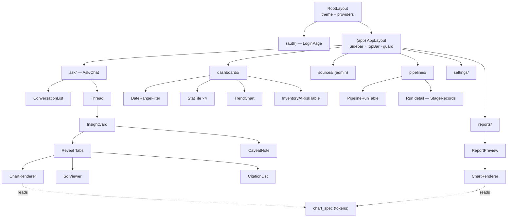

# 07 — Frontend

The frontend is the demo-facing surface of InsightGPT: a conversational
analytics workspace, interactive dashboards, data-source and pipeline
administration, and executive report generation. It is a **Next.js** (App
Router) + **TypeScript** + **Tailwind** + **shadcn/ui** application that
consumes the API in [`06-api.md`](06-api.md).

The bar is explicit in the project goals: *"polished enough to demo to a
non-technical audience"* ([`00-overview.md`](00-overview.md) §7). This document
is the design system, the route/component structure, the key screens, and the
data/auth/accessibility approach that get us there.

## 1. Design goals

1. **Portfolio-grade polish.** Consistent spacing, type, and color; no default
   unstyled components. It should look like a product, not a class project.
2. **Explainability made visible.** The UI's job is to surface *why* an answer
   is trustworthy — the SQL, the citations, the chart — one click away, never
   hidden and never in the way.
3. **Accessible by default.** Keyboard-navigable, screen-reader-labeled,
   WCAG-AA contrast in both themes. shadcn/ui (built on Radix primitives) gives
   us correct focus/ARIA behavior for free; we keep it.
4. **Responsive.** Works from a 360px phone to a wide desktop. Dashboards
   reflow; tables scroll within their own container, never the page.
5. **Dark / light.** A single token set drives both themes; charts included.
6. **Fast.** Server components render shell + first data; the client hydrates
   only what needs interactivity. Streamed answers appear token-by-token.

## 2. Design system

A small, enforced system — tokens first, components second.

### 2.1 Color tokens

Semantic CSS variables (HSL) defined once per theme on `:root` and
`.dark`, consumed through Tailwind. Components never hardcode hex.

| Token | Role |
|---|---|
| `--background` / `--foreground` | Page base / primary text |
| `--card` / `--card-foreground` | Surface panels (tiles, cards) |
| `--muted` / `--muted-foreground` | Secondary surfaces / subtle text |
| `--primary` / `--primary-foreground` | Brand actions, active nav |
| `--border` / `--input` / `--ring` | Hairlines, field borders, focus ring |
| `--success` / `--warning` / `--destructive` | Status (pipeline, at-risk, errors) |
| `--chart-1 … --chart-6` | Ordered categorical series palette |

The `--chart-*` ramp is the single source of truth for series color, chosen for
AA contrast against both backgrounds and distinguishable under common
color-vision deficiencies. The `ChartRenderer` (§5) reads these — charts are
never styled independently of the app theme.

### 2.2 Typography & spacing

- **Type scale** (Tailwind): `text-xs` 12 · `text-sm` 14 (body default) ·
  `text-base` 16 · `text-lg` 18 · `text-xl` 20 · `text-2xl` 24 (section) ·
  `text-3xl` 30 (page title / KPI value). Inter (or the system UI stack) for
  text; a mono face (JetBrains Mono / `ui-monospace`) for the SQL viewer.
- **Spacing**: Tailwind's 4px base; layout gutters standardize on `4` (16px)
  and `6` (24px). Cards use `p-6`; tile grids use `gap-4`.
- **Radius / elevation**: one `--radius` token (`0.5rem`); elevation via subtle
  borders + a single soft shadow on raised surfaces, not heavy drop shadows.

### 2.3 Component primitives (shadcn/ui)

We compose screens from a fixed primitive set so behavior stays consistent:
`Button`, `Card`, `Tabs`, `Dialog`, `Sheet`, `Table`, `Badge`, `Input`,
`Select`, `Popover`, `Tooltip`, `Toast`, `Skeleton`, `Calendar`/date-range,
`DropdownMenu`, `ScrollArea`. Domain components (§5) are built *on top of* these
— we do not fork primitives.

## 3. App structure (Next.js App Router)

```
web/app/
  (auth)/
    login/page.tsx              # unauthenticated
  (app)/                        # guarded layout — requires a valid session
    layout.tsx                  # sidebar nav, top bar, theme toggle
    page.tsx                    # redirect -> /ask
    ask/
      page.tsx                  # Ask / Chat (conversation list + thread)
      [conversationId]/page.tsx # a specific conversation
    dashboards/
      page.tsx                  # dashboard list
      [id]/page.tsx             # one dashboard
    sources/page.tsx            # data-source admin (admin only)
    pipelines/
      page.tsx                  # run history + triggers
      runs/[id]/page.tsx        # run detail
    reports/
      page.tsx                  # report list + generate
      [id]/page.tsx             # preview + export
    settings/page.tsx           # profile, theme, provider status
web/components/                 # domain components (see §5)
web/lib/                        # api client, auth, hooks, chart mapping
web/components/ui/              # shadcn/ui primitives
```

Route groups separate the **unauthenticated** `(auth)` shell from the
**guarded** `(app)` shell. The `(app)/layout.tsx` renders the persistent
sidebar + top bar and enforces auth (§6).

### 3.1 Route ↔ role

| Route | Min role | Notes |
|---|---|---|
| `/ask`, `/dashboards`, `/reports` (read) | viewer | reports read; generate is analyst+ |
| `/pipelines` (view) | analyst | trigger button gated to admin |
| `/sources` | admin | hidden from nav for lower roles |
| `/settings` | viewer | provider internals shown to admin only |

Nav items the role can't use are hidden, and the API re-checks every call — the
client gate is UX, not security ([`06-api.md`](06-api.md) §2).

## 4. Key screens

### 4.1 Ask / Chat

The centerpiece. A two-pane layout: a conversation list (left) and the active
thread (right).

- **Streaming answer.** On submit, the client opens the `/ask` SSE stream
  ([`06-api.md`](06-api.md) §6) and renders the narrative token-by-token into an
  `InsightCard`. A subtle typing indicator shows while `token` events flow.
- **Reveal panels (tabs).** Each answer carries tabs to expose its basis
  without cluttering the narrative:
  - **Answer** — the prose (default).
  - **Chart** — the inline `ChartRenderer` reading `chart_spec`.
  - **SQL** — the `SqlViewer` with the governed SQL (syntax-highlighted,
    copyable, read-only).
  - **Sources** — the `CitationList` of grounding documents with snippets and
    scores.
  The tabs light up only for the parts an answer actually has (an answer with no
  document grounding shows no Sources tab).
- **Example prompt chips.** On an empty thread, clickable chips seed the three
  flagship questions ("Why did sales decline last quarter?", "Which products
  should we restock?", "Summarize customer complaints this month.") so a
  first-time demo user has an instant on-ramp.
- **Conversation history.** The left list is `GET /conversations`; selecting one
  loads its stored envelopes and re-renders SQL/citations/charts exactly as
  first produced. A thumbs up/down control posts to `/feedback`.
- **Caveats.** Any `caveats` render as an inline, muted note under the answer,
  so freshness/assumption limits are never buried.

### 4.2 Dashboards

Governed, filterable analytics — never ad-hoc SQL from the client.

- **KPI stat tiles.** A row of `StatTile`s: **Revenue**, **Orders**, **AOV**
  (average order value), **Return rate** — each with value, unit, and a
  period-over-period delta (up/down, colored by `--success`/`--destructive`).
- **Trend charts.** `TrendChart`s (line/area) for revenue and orders over the
  selected range.
- **Top / bottom products.** Ranked bar charts or a compact table of best and
  worst SKUs by the active metric.
- **Inventory-at-risk table.** SKUs flagged by sell-through vs. lead time, with
  a `Badge` severity — the visual answer to "which products should we restock?"
- **Controls.** A date-range picker plus dimension filters (region, category)
  at the top. Every control change issues a `POST /metrics/query`
  ([`06-api.md`](06-api.md) §3.2) — the governed metric layer, so tiles and
  charts always agree and can never invent a join. Loading states use
  `Skeleton` tiles.

### 4.3 Pipelines

The data-engineering monitor.

- **Run history table.** `PipelineRunTable` from `GET /pipeline-runs`: pipeline
  name, trigger (manual/scheduled), started, duration, row counts, and a
  `StatusBadge` (`queued`/`running`/`success`/`failed`/`partial`).
- **Trigger run.** A "Run now" `Button` (admin only) posts
  `POST /pipelines/{name}/run`; a `409` (already running) surfaces as a toast
  linking to the active run rather than an error.
- **Run detail.** `runs/[id]` shows the per-stage breakdown — rows in/out,
  timings, and any error text — from `GET /pipeline-runs/{id}`. A running row
  polls for updates until terminal.

### 4.4 Reports

- **Generate.** A form (title, period, section checkboxes) posts `POST /reports`
  and returns a handle in `generating` state.
- **Preview.** `reports/[id]` renders the report blocks — headings, prose,
  inline charts (`chart_spec`), and citations — in a paged, document-like
  layout that mirrors the eventual PDF. Polls until `ready`.
- **Export PDF.** An "Export PDF" `Button` requests
  `GET /reports/{id}/export?format=pdf` and downloads the server-rendered file,
  so the export is byte-for-byte the previewed content.

### 4.5 Login / Settings

- **Login.** Email + password → `POST /auth/login`; on success stores the token
  pair (§6) and redirects to `/ask`.
- **Settings.** Profile, theme toggle (persisted), and — for admins — the active
  LLM provider + model and dependency status pulled from `/status`.

## 5. Component inventory

Domain components, each a thin, typed composition over shadcn/ui primitives.

| Component | Responsibility | Backed by |
|---|---|---|
| `StatTile` | KPI value + unit + period delta | `MetricResult` |
| `TrendChart` | Line/area time series | `ChartSpec` / metric rows |
| `ChartRenderer` | Render any `chart_spec` to Recharts/visx | `ChartSpec` (§6 note) |
| `InsightCard` | Streamed answer container + reveal tabs | `AnswerEnvelope` |
| `SqlViewer` | Read-only, highlighted, copyable SQL | `envelope.sql` |
| `CitationList` | Grounding docs: title, snippet, score | `Citation[]` |
| `CaveatNote` | Muted assumptions/limitations strip | `envelope.caveats` |
| `PromptChips` | Seed example questions | static + recent |
| `PipelineRunTable` | Run history rows | `PipelineRun[]` |
| `StatusBadge` | Colored run/service status | status enum |
| `DateRangeFilter` | Range + dimension filter bar | query params |
| `InventoryAtRiskTable` | Ranked at-risk SKUs | `MetricResult` |
| `ReportPreview` | Paged report blocks + export | `Report` |

### `ChartRenderer` and `chart_spec`

Charts are **not** rendered server-side or shipped as images. The backend
returns a declarative `chart_spec` ([`06-api.md`](06-api.md) §7); `ChartRenderer`
maps `kind` → the right Recharts/visx component and pulls series colors from the
`--chart-*` tokens (§2.1). This is deliberate:

- **Consistency** — every chart, whether from `/ask`, a dashboard, or a report,
  goes through one renderer and one palette, so they look like one system.
- **Accessibility** — charts inherit theme contrast, get text alternatives
  (a caption + an accessible data table toggle), and never rely on color alone
  (series also carry labels/markers).
- **Theming** — light/dark just works, because color comes from tokens, not the
  payload.

## 6. Data fetching, auth & state

### 6.1 Fetching

- **Server components** render the shell and first-load data (dashboard layout,
  conversation list, run history) by calling the API server-side — fast first
  paint, less client JS.
- **Typed API client.** `web/lib/api.ts` is generated from the API's OpenAPI
  schema, so request/response types match the pydantic models exactly and drift
  is a compile error, not a runtime surprise.
- **SSE for `/ask`.** The chat thread consumes the event stream directly (a
  `fetch` reader over `text/event-stream`), dispatching `token`/`sql`/
  `citations`/`chart`/`caveats`/`done`/`error` events into component state as
  they arrive. This is the one genuinely streaming interaction.
- **Client caching.** Interactive reads (metric queries on filter change, run
  polling) use a light data layer — **React Query** (TanStack Query) — for
  caching, background refetch, and polling. We deliberately avoid a heavy global
  store; server state lives in React Query, UI state in local component state.

### 6.2 Auth handling

- On login, the access token is held in memory and the **refresh token in an
  httpOnly, Secure, SameSite cookie** — refresh tokens are never exposed to JS,
  which limits XSS blast radius. Access tokens are re-minted transparently via
  `/auth/refresh` on 401.
- The `(app)` route group is protected: the layout validates the session
  server-side (via the refresh cookie) and redirects to `/login` when absent.
- Role-aware nav hides routes the user can't reach; the server still authorizes
  every call, so the client gate is convenience, not the security boundary
  ([`06-api.md`](06-api.md) §2).

### 6.3 State management

Kept intentionally light: **React Query for server state**, React context only
for cross-cutting UI concerns (theme, current user, toasts). No Redux/Zustand —
the app's complexity is in data, not client state, and React Query already owns
data.

## 7. Accessibility & performance checklist

**Accessibility**
- All interactive elements keyboard-reachable; visible `--ring` focus states.
- Radix/shadcn primitives supply correct roles, labels, and focus trapping
  (dialogs, menus, tabs).
- WCAG-AA contrast verified for text and `--chart-*` in both themes.
- Charts never rely on color alone (labels + markers) and offer a data-table
  alternative.
- Live regions announce streamed-answer completion and toast messages.
- Respects `prefers-reduced-motion` for the typing indicator and transitions.

**Performance**
- Server components + streaming for fast first paint; client JS only where
  interactive.
- Route-level code splitting; the chart library and `SqlViewer` highlighter are
  lazy-loaded (they're heavy and not needed on every route).
- `Skeleton` placeholders on every async panel; no layout shift on load.
- React Query dedupes and caches; polling backs off once a run is terminal.
- Tables/charts virtualize or paginate large result sets; the page body never
  scrolls horizontally.

## 8. Component / route hierarchy



## 9. Where to go next

- The API this app consumes → [`06-api.md`](06-api.md)
- Overall architecture and where the frontend sits →
  [`01-architecture.md`](01-architecture.md)
- The insight engine behind `/ask` → [`05-insight-engine.md`](05-insight-engine.md)
- Deployment (the `web` container) → [`09-deployment.md`](09-deployment.md)
