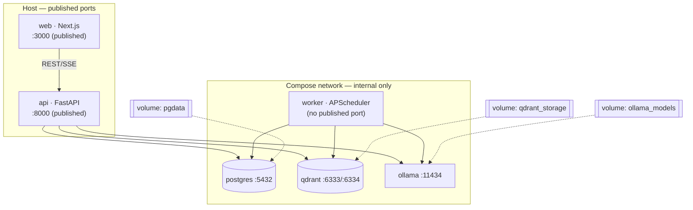
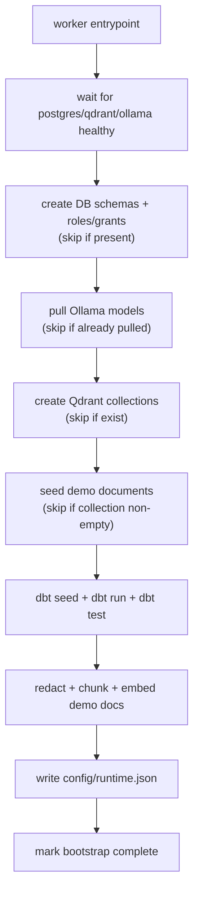

# 09 — Deployment

This document describes how InsightGPT is packaged, configured, brought up, and
moved to the cloud. The design goal is the one stated in
[`00-overview.md`](00-overview.md): **the full system comes up with a single
`docker compose up`**, and the same artifacts deploy to a cloud host with
documented, minimal changes.

Related reading: architecture and topology in
[`01-architecture.md`](01-architecture.md); the security posture that constrains
network exposure and secrets in [`08-security.md`](08-security.md); test/CI in
[`10-testing-eval.md`](10-testing-eval.md).

## 1. Docker Compose topology

Six services, wired on a private compose network. Only `web` and `api` publish
ports to the host; the data/model services are internal only (see
[`08-security.md`](08-security.md) §7).



### 1.1 Services

| Service | Image / build | Role | Published? |
|---|---|---|---|
| **web** | `docker/web.Dockerfile` (Next.js) | Frontend UI | Yes — `${WEB_PORT}:3000` |
| **api** | `docker/api.Dockerfile` (FastAPI/uvicorn) | REST + SSE, insight engine, auth | Yes — `${API_PORT}:8000` |
| **worker** | same image as api, different entrypoint | APScheduler jobs, pipeline runs, dbt invocations | No |
| **postgres** | `postgres:16` | Warehouse (`raw`/`staging`/`marts`) | No |
| **qdrant** | `qdrant/qdrant` | Vector DB | No |
| **ollama** | `ollama/ollama` | Local embeddings, rerank, default LLM | No |

`api` and `worker` share one image so that connectors, redaction, the semantic
layer, and DB models are defined once; only the entrypoint differs (uvicorn vs.
the scheduler loop).

### 1.2 Volumes (persistent state)

| Volume | Backs | Notes |
|---|---|---|
| `pgdata` | Postgres data dir | The warehouse — the durable source of truth |
| `qdrant_storage` | Qdrant storage | Vectors + payloads; rebuildable from documents |
| `ollama_models` | Pulled model blobs | Avoids re-downloading models on every restart |

`qdrant_storage` is **rebuildable** (re-index the documents), but `pgdata` for a
real deployment is not — back it up (Section 6).

### 1.3 Healthchecks & dependencies

Each service declares a healthcheck so that dependents wait for *readiness*, not
just container start:

- **postgres** — `pg_isready`.
- **qdrant** — HTTP `GET /readyz`.
- **ollama** — HTTP `GET /api/tags` (also confirms the model list is loadable).
- **api** — `GET /health` (checks DB + Qdrant + provider reachability).
- **web** — HTTP `GET /` on the app port.

Compose `depends_on` uses `condition: service_healthy` so `api` starts only when
`postgres`, `qdrant`, and `ollama` are healthy, and `web` starts after `api`.
The `worker` waits on the same data services as `api`.

## 2. Configuration

Configuration follows the **config-driven, no-hardcoded-ports** principle from
[`01-architecture.md`](01-architecture.md) §1:

- **`config/*.yaml`** — non-secret, environment-independent settings: semantic
  layer definitions, retrieval parameters (chunk sizes, top-k, rerank), model
  names, pipeline schedules. Checked into the repo.
- **`.env`** (gitignored) — secrets and per-deployment values. A committed
  **`.env.example`** documents every variable. No secrets in the repo or the
  vector store (see [`08-security.md`](08-security.md) §6).
- **`config/runtime.json`** — **discovered** runtime values (actual bound ports,
  resolved service hosts) written at bring-up so nothing downstream hardcodes a
  port. Clients read the resolved values from here rather than assuming `8000`.

### 2.1 Key environment variables (`.env.example`)

```dotenv
# --- Ports (host-published; override to avoid conflicts) ---
WEB_PORT=3000
API_PORT=8000

# --- Database ---
POSTGRES_HOST=postgres
POSTGRES_PORT=5432
POSTGRES_DB=insightgpt
POSTGRES_USER=insight_app          # analytics/app role (read-only on marts)
POSTGRES_PASSWORD=change-me
POSTGRES_INGEST_USER=insight_etl   # write role for dbt/ingestion (not in request path)
POSTGRES_INGEST_PASSWORD=change-me

# --- Auth ---
JWT_SECRET=change-me-long-random
JWT_EXPIRES_MINUTES=60

# --- Vector DB ---
QDRANT_HOST=qdrant
QDRANT_PORT=6333
# QDRANT_API_KEY=                  # REQUIRED if qdrant is ever exposed beyond the compose net

# --- Local models (Ollama) ---
OLLAMA_HOST=http://ollama:11434
EMBED_MODEL=nomic-embed-text
RERANK_MODEL=<local-cross-encoder>

# --- LLM provider (pluggable) ---
LLM_PROVIDER=ollama                # ollama (default) | openai | gemini | groq
LLM_MODEL=<provider-model-name>
# OPENAI_API_KEY=                  # only if LLM_PROVIDER=openai
# GEMINI_API_KEY=                  # only if LLM_PROVIDER=gemini
# GROQ_API_KEY=                    # only if LLM_PROVIDER=groq
```

The two Postgres roles are deliberate: the **app role is read-only on `marts`**
and is the only role the API uses; the **ingest role can write** and is used
only by dbt/ingestion in the worker. This is the DB half of the SQL-safety model
(see [`08-security.md`](08-security.md) §3).

## 3. One-command bring-up & first-run bootstrap

```bash
cp .env.example .env      # then edit secrets
docker compose up         # builds, starts, and self-bootstraps
```

On first run, an **idempotent bootstrap** (`scripts/bootstrap.py`, invoked by
the worker's entrypoint) brings the system from empty volumes to a demo-ready
state. Idempotent means it is **safe to re-run** — every step checks state
before acting, so a second `docker compose up` is a no-op, and a partial failure
can simply be re-run.



Bootstrap steps in order:

1. **Create DB schemas and roles.** Create `raw`/`staging`/`marts`, the app and
   ingest roles, and apply the read-only grants — only if they do not yet exist.
2. **Pull Ollama models.** Pull the embedding, rerank, and (for the local
   default) reasoning models — skipped for any model already present in the
   `ollama_models` volume.
3. **Create Qdrant collections** with the configured vector params — skipped if
   they exist.
4. **Seed demo documents** (synthetic tickets/reviews/reports) — skipped if the
   collection is already populated.
5. **dbt `seed` + `run` + `test`** to build the star schema and semantic layer
   from the synthetic dataset, and to assert data quality
   ([`10-testing-eval.md`](10-testing-eval.md) §3).
6. **Redact + chunk + embed** the demo documents into Qdrant.
7. **Write `config/runtime.json`** with the resolved ports/hosts.

A `bootstrap_complete` marker (a row in a metadata table) lets the step be
skipped wholesale on subsequent boots, while individual steps remain
independently idempotent.

## 4. Local development workflow

Docker Compose is the integration path; day-to-day development runs services
individually against the containerized data stores.

- **Python (api, worker, ingestion, retrieval)** — managed with **uv**:

  ```bash
  uv sync                         # install locked deps
  uv run uvicorn services.api.main:app --reload    # api
  uv run python -m services.worker                  # scheduler
  uv run pytest                    # tests + eval harnesses
  ```

- **Web (Next.js)** — **pnpm** (npm works too):

  ```bash
  pnpm install
  pnpm dev                         # http://localhost:3000
  ```

- **Data stores only** — run just the backing services while developing app code
  on the host:

  ```bash
  docker compose up postgres qdrant ollama
  ```

  The app reads `POSTGRES_HOST`, `QDRANT_HOST`, `OLLAMA_HOST` from `.env`, so
  pointing a host-run API at container stores is a config change, not a code
  change.

- **dbt** — run from `services/warehouse`:

  ```bash
  uv run dbt seed && uv run dbt run && uv run dbt test
  ```

## 5. Cloud portability

The architecture is deliberately **cloud-portable** rather than cloud-specific.
This is a documented path, not a full IaC deliverable. Two shapes are supported.

### 5.1 Single VM (lift-and-shift)

The simplest cloud deployment is the same `docker compose up` on a VM:

- Provision a VM (e.g. 4 vCPU / 8–16 GB RAM), install Docker + Compose, clone the
  repo, set `.env`, run `docker compose up -d`.
- Put a reverse proxy (Caddy/Nginx) in front of `web` and `api` for TLS.
- **GPU note:** without a GPU, the local Ollama reasoning model will be slow.
  Either keep small local models for embeddings/rerank and switch
  `LLM_PROVIDER` to a cloud key for the heavy reasoning step, or size the VM
  accordingly.

### 5.2 PaaS (Render / Railway / Fly)

For a managed platform, decompose the compose file into managed pieces:

| Compose service | On PaaS |
|---|---|
| **postgres** | **Managed Postgres** (the provider's add-on). Point `POSTGRES_HOST` at it; run bootstrap/dbt as a one-off job. |
| **qdrant** | Qdrant as a container service **or** Qdrant Cloud. Set `QDRANT_HOST` and add `QDRANT_API_KEY` (now that it is network-exposed — see [`08-security.md`](08-security.md) §7). |
| **ollama** | Usually **dropped** on GPU-less PaaS hosts. Set `LLM_PROVIDER` to a cloud key for reasoning; use a hosted/cloud embedding path or a small CPU embedding service for embeddings. |
| **api** | Stateless web service; scale horizontally (Section 7). |
| **worker** | Single background/worker instance (scheduler must be a singleton — Section 7). |
| **web** | Static/Node web service; point it at the public `api` URL. |

**What changes vs. local:** managed Postgres instead of the `postgres`
container; external Qdrant (with an API key) instead of loopback Qdrant; and —
because GPU-less hosts cannot run large local models well — a **cloud LLM key**
for the reasoning step. Everything reachable via config; no code changes.

**Resource notes:** api/worker are modest (CPU-bound on request handling and
embedding I/O). Postgres sizing tracks warehouse size. Qdrant memory tracks
vector count. The heavy compute is the reasoning LLM, which is why offloading it
to a cloud key is the standard PaaS adaptation.

## 6. Backup & restore

Two stores hold state; back up both, and treat backups as sensitive (see
[`08-security.md`](08-security.md) §9).

- **Warehouse (Postgres) — authoritative:**

  ```bash
  # backup
  docker compose exec postgres pg_dump -U "$POSTGRES_USER" -d "$POSTGRES_DB" -Fc > backup.dump
  # restore
  docker compose exec -T postgres pg_restore -U "$POSTGRES_USER" -d "$POSTGRES_DB" --clean < backup.dump
  ```

- **Vector data (Qdrant) — rebuildable:** use Qdrant **snapshots**
  (`POST /collections/{name}/snapshots`) for a fast restore, or simply
  **re-index** the documents from source via bootstrap (Section 3), since the
  redacted document corpus is the source of truth for the vectors.

- **Config/secrets:** `.env` and `config/*.yaml` are backed up out-of-band by
  the operator (a secret store), never committed.

A restore drill is part of "done" for the deployment milestone: restore into a
clean environment and confirm the demo questions still answer correctly.

## 7. Scaling notes

- **api — horizontal.** The API is **stateless** (JWT auth, no server-side
  session). Run multiple replicas behind a load balancer; SSE streams are
  per-request and do not require sticky routing beyond the life of one stream.
- **worker — singleton.** The APScheduler worker **must run as a single
  instance**; two schedulers would double-fire pipeline jobs. Scale the *work*
  by making individual jobs heavier/parallel internally, not by adding scheduler
  replicas. (If HA is ever required, add a leader-lock — out of scope here.)
- **postgres / qdrant — vertical.** Scale the data stores up (CPU/RAM/disk)
  rather than out for this single-organization scope. Postgres read replicas and
  Qdrant sharding are possible later but unnecessary for the demo domain.
- **ollama / reasoning LLM — the real bottleneck.** On CPU it is the slow step;
  the pluggable provider means quality/throughput can be raised by pointing at a
  cloud key without touching application code.
