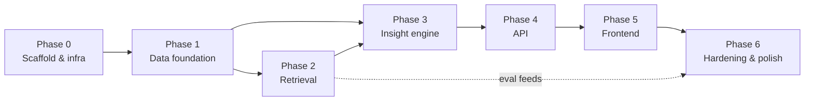

# 11 — Roadmap & Build Plan

This document is the **build plan the maintainer approves before any code is
written**. It sequences the work in [`01-architecture.md`](01-architecture.md)
into phases with concrete deliverables and acceptance criteria. It is the
companion to every service doc (02–10): each phase below realizes the design
those documents specify.

## 1. Current state

- **Documentation:** complete for the phases described here (docs 00–11).
- **Implementation:** **pending maintainer approval of this plan.** No service
  code is written yet; this document defines what "done" means for each step so
  approval is a decision about a concrete, bounded plan rather than an open
  brief.

Nothing in Phase 0+ starts until this plan is approved. The build order is:
**docs → approved plan → vertical slice → iterate**, matching the sequence in
[`00-overview.md`](00-overview.md) and [`01-architecture.md`](01-architecture.md).

## 2. Guiding approach — vertical slice first

The biggest risk in a system with this many layers (warehouse, retrieval,
insight engine, API, UI) is integrating them late and discovering the seams
don't fit. So the plan **does not build each layer to completion in turn.**
Instead it builds a **thin vertical slice** first: a single question answered
end to end through *every* layer, with everything else stubbed. That proves the
contracts between services early, then each phase **broadens** the slice rather
than bolting on a disconnected subsystem.

Concretely: Phases 0–1 stand up the minimum data and infrastructure; Phases 2–5
each add one layer to the slice; Phase 6 hardens the whole. The slice question
is fixed up front (see the box in §4) and is the first integration target the
moment the API and UI exist.

> **Sequencing note.** Phase numbers indicate primary order, but the plan is
> deliberately slice-shaped: a minimal, correct path through a layer lands
> before that layer is broadened. "Rough sequencing" per phase below gives the
> internal order; phases overlap where a later phase's stub is enough to unblock
> integration.

## 3. Phases

### Phase 0 — Repo scaffold & infrastructure

**Goal.** A developer can clone the repo and bring the whole (empty) system up
with one command; every service exists as a runnable stub.

**Deliverables.**
- Monorepo layout per [`01-architecture.md`](01-architecture.md) §8
  (`services/{api,worker,ingestion,retrieval,warehouse}`, `web/`, `data/`,
  `config/`, `docker/`, `scripts/`, `tests/`).
- `docker/compose.yml` with services: `postgres`, `qdrant`, `ollama`, `api`,
  `worker`, `web` — the last three as health-check stubs.
- Configuration: YAML in `config/`, runtime discovery in `config/runtime.json`,
  `.env.example`; no hardcoded ports/paths.
- CI skeleton (lint + typecheck + a placeholder test job) that runs green.
- `scripts/bootstrap` (or equivalent) that sets up the dev environment and pulls
  the default Ollama models.

**Acceptance criteria.**
- `docker compose up` brings all six services to healthy; `api` and `web`
  respond on their health endpoints; `postgres`, `qdrant`, `ollama` are
  reachable from `api` and `worker`.
- CI is green on a fresh checkout.
- No secrets in the repo; config is read from env/YAML.

**Rough sequencing.** repo layout → compose + service stubs → config/env → CI →
bootstrap script.

### Phase 1 — Data foundation

**Goal.** A modeled, tested warehouse exists with a **real, discoverable cause**
planted in the data, so the slice question has a genuine answer.

**Deliverables.**
- Synthetic retail/e-commerce dataset generator in `data/` with an
  **intentional quarterly sales dip** plus baseline **seasonality**, so
  *"Why did sales decline last quarter?"* decomposes to a specific
  region/category/product cause (aligned with [`02-data-model.md`](02-data-model.md)).
- Raw load into the Postgres `raw` schema.
- dbt project (`services/warehouse`): staging → marts, producing the star
  schema (fact + dimension tables) and the **semantic metrics** layer.
- dbt tests (uniqueness, not-null, relationships, accepted values) on keys and
  metrics.

**Acceptance criteria.**
- `dbt build` runs clean; all dbt tests pass.
- The planted dip is provably visible: a hand-written SQL query over the marts
  reproduces the quarter-over-quarter decline and attributes it to the intended
  dimension(s).
- The semantic metrics (e.g. `revenue`, `orders`, `by_region`) are defined and
  queryable as specified in [`02-data-model.md`](02-data-model.md).

**Rough sequencing.** dataset generator (with planted cause) → raw load → dbt
staging → dbt marts/star schema → semantic metrics → dbt tests.

### Phase 2 — Retrieval

**Goal.** Business documents are indexed and retrievable with measured quality.

**Deliverables.**
- Document ingestion into `services/retrieval`: **redaction** (secrets/PII)
  before persistence, heading/section-aware **chunking**, **Ollama embeddings**,
  storage in **Qdrant** with dense + sparse vectors.
- **Hybrid search** (dense + sparse fused with RRF) → **cross-encoder rerank** →
  per-source diversity, per [`04-retrieval-rag.md`](04-retrieval-rag.md).
- Sample documents (tickets/reviews/reports) whose themes align with the planted
  sales dip from Phase 1.
- A **retrieval eval harness** with a labeled query set.

**Acceptance criteria.**
- Redaction verified: no secrets/PII reach Qdrant (asserted by a test).
- For the slice question's document need, relevant chunks appear in the reranked
  top-k.
- The retrieval eval harness runs and reports metrics (e.g. recall@k, MRR) —
  quality is measured, not asserted ([`10-testing-eval.md`](10-testing-eval.md)).

**Rough sequencing.** ingestion + redaction → chunking → embeddings → Qdrant
index → hybrid search + rerank → eval harness.

### Phase 3 — Insight engine

**Goal.** A question becomes a grounded, cited answer envelope — the core thesis
of the project.

**Deliverables.**
- **NL router** classifying a question into structured (text-to-SQL),
  unstructured (RAG), or hybrid paths.
- **Semantic-layer-grounded text-to-SQL**: the LLM maps the question onto
  semantic metrics/dimensions; the engine composes the SQL — plus **guardrails**
  (read-only role, table allow-list, mandatory `LIMIT`).
- **Hybrid synthesis** combining numbers + document context into a single cited
  answer with an optional chart spec (the **answer envelope**).
- **Pluggable LLM provider** (local Ollama default; OpenAI/Gemini/Groq optional
  via config), per [`05-insight-engine.md`](05-insight-engine.md).
- A **text-to-SQL eval harness**.

**Acceptance criteria.**
- The slice question produces a correct answer envelope: narrative + the exact
  SQL executed + document citations + chart spec.
- Guardrails reject writes, non-allow-listed tables, and unbounded queries
  (tested).
- Swapping the LLM provider via config requires no code change.
- The text-to-SQL eval harness runs and reports accuracy on a labeled set.

**Rough sequencing.** provider abstraction → router → grounded text-to-SQL +
guardrails → synthesis/answer envelope → eval harness.

### Phase 4 — API

**Goal.** The engine is reachable over HTTP with auth, streaming, and
observability.

**Deliverables.**
- FastAPI endpoints: `/ask` (SSE), `/dashboards`, `/pipelines`, `/reports` and
  supporting routes, per [`06-api.md`](06-api.md).
- **JWT auth with roles** (admin/analyst/viewer).
- **SSE streaming** of the answer envelope.
- **Pipeline-run tracking** surfaced from the worker (status, row counts,
  timings).
- **Observability**: structured logs, request IDs, LLM-call tracing.

**Acceptance criteria.**
- `POST /ask` streams the slice question's answer end to end from the real
  warehouse + index.
- Role checks enforced (a viewer cannot trigger admin actions; tested).
- Pipeline runs are queryable via the API and record status/metrics.

**Rough sequencing.** app skeleton + auth → `/ask` + SSE → pipeline endpoints →
observability.

### Phase 5 — Frontend

**Goal.** A polished UI a non-technical audience can be shown.

**Deliverables.**
- Next.js app (`web/`): chat/ask view with **streaming** and a progressive
  reveal of **SQL / citations / chart**.
- Interactive **dashboards**.
- **Pipeline monitor** and data-source admin.
- **Reports / export** (executive report generation), per
  [`07-frontend.md`](07-frontend.md).

**Acceptance criteria.**
- A user asks the slice question in the UI and sees the streamed narrative, then
  can reveal the SQL, the cited documents, and the chart.
- Dashboards render from live warehouse data.
- The pipeline monitor reflects real worker runs.

**Rough sequencing.** chat/ask + streaming → SQL/citation/chart reveal →
dashboards → pipeline monitor → reports/export.

### Phase 6 — Hardening & polish

**Goal.** The system is secure, tested, documented, and demo-ready.

**Deliverables.**
- Security pass against [`08-security.md`](08-security.md) (redaction coverage,
  read-only role, allow-lists, auth, prompt-injection defenses for
  document-sourced content).
- All tests + eval harnesses green in CI; coverage of the critical paths.
- Docs synced to the built system (docs are source of truth; reconcile drift).
- A **demo script** walking the three headline questions.
- **Executive-report generation** finalized and exportable.

**Acceptance criteria.**
- All three headline questions from [`00-overview.md`](00-overview.md) return
  correct, cited answers from real data.
- `docker compose up` brings up a fully working system from scratch.
- CI green including retrieval + text-to-SQL evals above their thresholds.
- The demo script runs start to finish without manual patching.

**Rough sequencing.** security pass → test/CI hardening → docs sync → demo
script → report polish.

## 4. Vertical-slice definition

> ### The first integration target
>
> **One question, threaded through every layer:**
> **_"Why did sales decline last quarter?"_**
>
> | Layer | What the slice must do |
> |---|---|
> | **Data** (Ph. 1) | Warehouse contains the planted quarterly dip with a real, attributable cause in the marts + semantic metrics. |
> | **Retrieval** (Ph. 2) | Support tickets/reviews/reports for that period are indexed; relevant chunks retrievable and reranked. |
> | **Engine** (Ph. 3) | Router → grounded text-to-SQL decomposes the decline by dimension; synthesis fuses numbers + document themes into a cited answer envelope. |
> | **API** (Ph. 4) | `POST /ask` streams that envelope over SSE with auth. |
> | **UI** (Ph. 5) | Chat view shows the streamed narrative with SQL, citations, and chart revealed on demand. |
>
> Everything outside this path (other questions, other dashboards, admin
> screens) is stubbed until the slice is green end to end. Once it is, each
> phase **broadens** the slice rather than adding disconnected features.

## 5. Risks & mitigations

| Risk | Impact | Mitigation |
|---|---|---|
| Local LLM reasoning quality on CPU is weak | Poor narratives / wrong decomposition | Pluggable provider — keep local as default, allow a cloud key for the heavy reasoning step; keep embeddings/rerank local. |
| Text-to-SQL accuracy (hallucinated joins/aggregations) | Wrong numbers, lost trust | Ground on the governed semantic layer (LLM picks metrics, engine writes SQL); guardrails; text-to-SQL eval harness gating changes. |
| Scope creep across domains/features | Nothing finished well | Single retail/e-commerce domain (a stated non-goal to broaden); vertical slice first; features broaden the slice, not sprawl. |
| Late integration of many services | Seams don't fit; rework | Vertical slice as the first integration target; service contracts proven early with stubs. |
| Retrieval surfaces secrets/PII | Privacy failure | Redaction at ingestion before persistence/embedding; test asserts nothing sensitive reaches Qdrant. |
| Unbounded/destructive SQL from generated queries | Data risk, runaway queries | Read-only analytics role, table allow-list, mandatory `LIMIT`, guardrail tests. |
| Quality claimed but not measured | Unverifiable evaluation | Retrieval + text-to-SQL eval harnesses report metrics in CI ([`10-testing-eval.md`](10-testing-eval.md)). |
| Environment/setup fragility on a modest laptop | Can't reproduce or demo | Config-driven, idempotent setup; one-command `docker compose up`; bootstrap script; runtime discovery of ports/paths. |

## 6. Phase dependencies & timeline

```mermaid
gantt
    title InsightGPT build plan (relative sequencing)
    dateFormat  X
    axisFormat  P%s
    section Foundation
    Phase 0 — Scaffold & infra      :p0, 0, 1
    Phase 1 — Data foundation       :p1, after p0, 2
    section Slice layers
    Phase 2 — Retrieval             :p2, after p1, 2
    Phase 3 — Insight engine        :p3, after p1, 2
    Phase 4 — API                   :p4, after p3, 1
    Phase 5 — Frontend              :p5, after p4, 2
    section Finish
    Phase 6 — Hardening & polish    :p6, after p5, 2
```

Phases 2 and 3 both depend on Phase 1's data; Phase 3's synthesis consumes
Phase 2's retrieval, so the two proceed in parallel with retrieval's minimal
path landing first to unblock the hybrid answer. The slice is not "green" until
Phase 5 shows it in the UI; Phase 6 hardens the whole.

## 7. Where to go next

- System design this plan realizes → [`01-architecture.md`](01-architecture.md)
- Documentation index & reading paths → [`README.md`](README.md)
- The layer each phase builds → docs [`02`](02-data-model.md)–[`10`](10-testing-eval.md)
