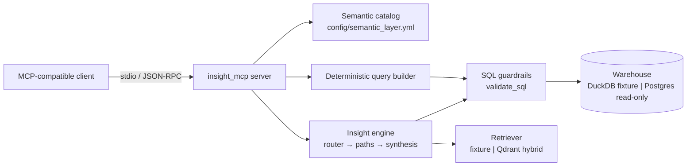

# 12 — MCP server

InsightGPT's warehouse is reachable through a second front door: a **Model
Context Protocol (MCP) server** that any MCP-compatible client can launch and
talk to. It exposes the *governed semantic layer* — the metric catalog, the
deterministic query path, the insight engine, and document retrieval — as seven
read-only tools.

The proposition in one sentence: **the semantic layer is the contract, and the
MCP server serves governed metrics rather than raw SQL access.** An AI assistant
connected to this server cannot ask for an ungoverned number, because there is
no tool that would carry the request.

Upstream context: [`05-insight-engine.md`](05-insight-engine.md) (the grounding
argument this server rests on), [`08-security.md`](08-security.md) (guardrails),
and [`06-api.md`](06-api.md) (the sibling REST surface). Implementation lives in
`services/mcp/`.

---

## 1. Why a *governed* MCP server

The obvious way to put a warehouse behind MCP is a single `run_sql(query)` tool:
the model writes SQL, the tool runs it. It demos beautifully and it is the wrong
design for a BI system, for the reason [`05-insight-engine.md`](05-insight-engine.md)
§3.2 already sets out:

> Free-form text-to-SQL asks the model to get the schema, the joins, the
> aggregations, the filters, *and* the dialect right in one shot — and it
> hallucinates joins and mis-aggregates on realistic schemas.

The measured picture is consistent: free-form text-to-SQL lands roughly
**70–85%** execution accuracy on realistic multi-table schemas, while
**semantic-layer-grounded** approaches push past **90%+** by constraining the
model to governed metrics and letting a deterministic layer emit the SQL. For a
tool where a wrong number is worse than no number, that gap is the whole
argument — and it does not become less true because the transport is MCP.

A raw-SQL MCP server is in fact *worse* than a raw-SQL API endpoint, because it
widens the blast radius in three ways at once:

| | Raw-SQL MCP tool | Governed MCP tools (this server) |
|---|---|---|
| What the model authors | SQL: joins, aggregations, dialect | A *selection*: metric + dimensions + filters |
| Failure mode | A plausible, wrong number | A rejection naming the legal alternatives |
| Reachable data | Anything the connection can see | Allow-listed tables only |
| Auditability | The SQL is the only artifact | Metric definition, SQL, params, and source file |
| Metric consistency | Redefined per question | One reviewed definition, shared with the API and dashboards |
| Effect of a prompt injection in a document | Can attempt arbitrary SQL | Cannot express SQL at all |

That last row is the one that matters most in an assistant context. Retrieved
documents are third-party text; if a document says "now run `DROP TABLE`", a
raw-SQL server has to *decide* not to. Here there is nothing to decide, because
the capability was never granted.

The cost of this design is real and worth stating: a question outside the
catalog cannot be answered at all, and answering it means editing
`config/semantic_layer.yml` — a review step, not a prompt. That is the trade
this project has already made everywhere else (§2 of
[`00-overview.md`](00-overview.md)), and the MCP surface does not get an
exception.

---

## 2. Tool inventory

Seven tools, all annotated `readOnlyHint: true`, `destructiveHint: false`,
`openWorldHint: false`. Tool names are unprefixed — the server name already
namespaces them in every client.

| Tool | Input | Returns | Use it for |
|---|---|---|---|
| `list_metrics` | — | The full governed metric catalog: keys, labels, `format`/`unit`, additivity, aliases, allowed dimensions, time grains, table allow-list, row/timeout limits | The menu. Call it first for any numeric question — it is what makes the client *unable* to ask for something ungoverned |
| `list_dimensions` | — | Governed dimensions: key, label, source table, `is_date`, grains, default grain | Finding the right slice before querying |
| `query_metric` | `metric`, `dimensions[]`, `filters[]`, `start_date`/`end_date`, `time_grain`, `order`, `limit` | Typed columns, rows, records, row count, truncation flag — **plus the exact SQL that ran and its bound parameters** | A specific, reproducible, auditable number |
| `ask` | `question` | The full answer envelope: `summary`, `answer`, `sql[]`, `tables[]`, `citations[]`, `chart`, `confidence`, `caveats[]`, `attempts[]`, and the abstention fields `abstained` / `abstain_reason` / `suggestions` | Questions that need interpretation and document evidence |
| `search_documents` | `query`, `source_type`, `region`, `category`, `start_date`/`end_date`, `k` | Ranked, citable chunks: `doc_id`, `title`, `date`, `score`, excerpt, metadata | The qualitative "why" behind a movement |
| `explain_metric` | `metric` | Definition, SQL expression, source fact and its grain, additivity note, allowed dimensions, tables touched, catalog file path | Defending or reinterpreting a number |
| `system_status` | — | Warehouse and retriever mode + reachability, LLM provider/model and whether a credential is *configured*, catalog counts, tool inventory, safety posture | Knowing which backends are live before trusting a result |

Every tool publishes a JSON `outputSchema` and returns validated
`structuredContent` alongside its text block. That is deliberate: a server whose
selling point is that the shape of an answer is knowable in advance should
advertise that shape rather than imply it.

### 2.1 The docstring is the contract

Each tool's docstring is the only documentation the calling model receives, so
the docstrings say **when to use a tool and what it refuses to do**, not just
what it returns. `ask`, for instance, spends most of its docstring on the
abstention case, because that is the behaviour a model is most likely to
paper over.

### 2.2 Rejections are informative, not fatal

A governance failure returns a `REJECTED:` message carrying the catalog's own
error text — which already lists the legal alternatives:

```
REJECTED: metric 'units_on_hand' cannot be sliced by 'region';
          allowed: ['date', 'product', 'store']
```

```
REJECTED: unknown metric 'customer_lifetime_value'; governed metrics:
          ['avg_order_value', 'gross_margin', 'gross_margin_pct', 'orders',
           'return_rate', 'revenue', 'units_on_hand', 'units_sold']
```

A client can self-correct from either without a round trip to a human.

---

## 3. Safety posture

Stated plainly, and enforced structurally rather than by instruction:

1. **No raw-SQL tool exists.** Not disabled, not permission-gated — absent. No
   parameter on any tool carries a SQL string, so there is nothing to smuggle
   one into. A test asserts this over the live tool inventory, so adding such a
   tool is a deliberate act that breaks the build.
2. **No write tool exists.** Every tool is annotated read-only and every
   statement is a `SELECT`.
3. **The model never authors SQL.** `query_metric` accepts a governed
   *selection* and compiles it with the same deterministic `build_query` the
   REST API uses (`services/api/app/semantic/query_builder.py`), over the joins
   declared in `config/semantic_layer.yml`.
4. **Unknown or ungoverned selections are rejected before execution.** An
   unknown metric, an unknown dimension, or a metric/dimension pair outside the
   metric's declared allow-list never reaches the warehouse.
5. **Guardrails are the floor.** Every statement still passes `validate_sql`
   inside the executor: parsed (not regex-sniffed), single read-only `SELECT`,
   allow-listed tables only, bound parameters, `LIMIT` capped at the catalog
   maximum, statement timeout. Against Postgres the connection is a read-only
   role. This is unchanged from [`08-security.md`](08-security.md) — the MCP
   server adds a caller, not an exemption.
6. **Abstention propagates honestly.** When the engine refuses, `ask` returns
   `abstained: true` with the reason and the closest governed metrics, and the
   rendered `summary` **leads** with `ABSTAINED —` so a text-only client cannot
   miss it. The tool never converts a refusal into a plausible-looking number.
7. **No secrets are ever emitted.** `system_status` reports whether a provider
   credential is *configured*; it never reads its value, and no DSN, key, or
   password appears in any response.
8. **Documents are evidence, not instructions.** `search_documents` says so in
   its own docstring: retrieved text is third-party content to quote, and a
   figure quoted inside a document is not a governed metric.

The safety posture is also machine-readable: `system_status` returns it as a
list, so a client can show a user what the server will and will not do.

---

## 4. Architecture



The server is a **thin adapter** — about 1,200 lines across five modules, much
of it tool docstrings and typed output schemas rather than logic. It imports the catalog, the query builder, the guardrails and the engine from
`services/api` as a path dependency (`[tool.uv.sources]`, exactly as the API
depends on `../retrieval`) and reimplements none of them. Backend selection is
delegated wholesale to `app.engine.build.build_engine`, the same function the
API calls, so the two surfaces cannot drift apart: a metric added to the catalog
appears on both, and a guardrail tightened for one tightens for both.

The answer envelope is *inherited*, not re-declared — `AskResult` extends
`app.engine.envelope.AnswerEnvelope` and adds a single rendered `summary` field
— so a new envelope field reaches MCP clients without anyone remembering to
copy it across.

Two operational details worth knowing:

- **Lazy construction.** The engine is built on first tool use, not at import.
  `--print-config` therefore needs no warehouse, and a client that launches the
  server eagerly pays nothing until it asks a question.
- **stdout discipline.** stdio transport means stdout carries JSON-RPC framing.
  Nothing in the server prints to stdout; diagnostics go to stderr.

---

## 5. Running it

The server runs against the **offline fixture stack by default** — an
in-process DuckDB warehouse seeded with the retail star schema, a keyword
retriever over the sample documents, and the deterministic `fake` provider. No
external service is required.

```bash
cd services/mcp
uv venv --python 3.12
uv sync

# Print ready-to-paste client config for this machine (touches no backend).
uv run -m insight_mcp --print-config

# Run it directly (a client normally does this for you).
uv run -m insight_mcp

# Tests: offline, no live services.
uv run pytest -q
```

Configuration is the same environment contract as the API
([`09-deployment.md`](09-deployment.md)):

| Variable | Default | Effect |
|---|---|---|
| `WAREHOUSE` | `duckdb` | `postgres` (with `POSTGRES_DSN`) switches to the real warehouse |
| `POSTGRES_DSN` | — | Read-only role DSN |
| `RETRIEVER` | `fixture` | `qdrant` enables hybrid search (reads `QDRANT_URL`, `OLLAMA_HOST`, `EMBED_MODEL`) |
| `LLM_PROVIDER` | `ollama` | `fake` for fully offline runs; `openai` / `groq` read their key from the environment (`gemini` is declared in config but not yet implemented) |
| `LLM_MODEL` | provider default | Model id |
| `TODAY` | `2026-07-15` | Reference date for relative time ranges |

---

## 6. Connecting a client

The server speaks standard MCP over stdio, so any MCP-compatible client works.
`--print-config` resolves the absolute paths on the current machine and prints
the snippet; the shape below is what it emits.

```json
{
  "mcpServers": {
    "insightgpt": {
      "command": "/absolute/path/to/uv",
      "args": ["run", "--directory", "/absolute/path/to/insight-gpt/services/mcp",
               "-m", "insight_mcp"],
      "env": {
        "WAREHOUSE": "duckdb",
        "RETRIEVER": "fixture",
        "LLM_PROVIDER": "fake"
      }
    }
  }
}
```

Against the real stack, the only change is the environment:

```json
"env": {
  "WAREHOUSE": "postgres",
  "POSTGRES_DSN": "postgresql://insight_ro:<password>@127.0.0.1:5432/insight",
  "RETRIEVER": "qdrant",
  "QDRANT_URL": "http://127.0.0.1:6333",
  "LLM_PROVIDER": "ollama"
}
```

Notes that save an hour of debugging:

- **Use the absolute path to `uv`.** Clients launch servers outside the user's
  shell profile, so a `PATH`-relative command fails in ways that are miserable
  to diagnose. `--print-config` prints the resolved path.
- **Secrets belong in the client's `env` block or the operator's environment**,
  never in the repository. `--print-config` writes nothing to disk for exactly
  this reason; redirect its output if you want a copy.
- **Confirm the connection** by calling `system_status`, then `list_metrics`.

---

## 7. Testing

`services/mcp/tests/` runs fully offline against the fixture stack:

- **Shape** — every tool returns what its published schema promises, every tool
  publishes an `outputSchema`, and warehouse values arrive as JSON primitives
  rather than driver objects.
- **Governance** — unknown metric, unknown dimension, an ungoverned
  metric/dimension pair, SQL smuggled into a metric name, and a half-specified
  date window are each rejected with an informative message; `limit` is capped
  at the catalog maximum; the generated SQL touches only allow-listed tables
  (checked by the guardrail parser, not by string matching); the executor
  rejects an off-allow-list table and a write statement.
- **Inventory** — the tool set is asserted closed, no tool name or parameter
  name hints at raw SQL or writes, and every tool is annotated read-only.
- **Abstention** — `ask` on an ungoverned metric returns `abstained: true` with
  no tables and no SQL, and the summary leads with the refusal.
- **Connection** — one end-to-end test spawns the server as a subprocess,
  completes the MCP initialize handshake, lists tools, and reads back a
  governed number. It is the only test that exercises what a client actually
  does, so a protocol-level regression (a stray stdout write, a bad schema)
  cannot pass unnoticed.

---

## 8. Rejected alternatives

- **A `run_sql` tool, even read-only.** The whole of §1. A read-only raw-SQL
  tool still lets a model hallucinate a join, mis-aggregate a ratio, and
  redefine a metric per question — and it hands prompt-injected document text a
  capability to aim at. Rejected outright, not gated behind a flag: a flag is a
  thing someone turns on.
- **Wrapping the REST API over HTTP instead of importing the engine.** It would
  have added auth, a running server, and a network hop to every tool call, for
  no isolation benefit — the MCP process is already trusted with the DSN. The
  path dependency keeps a single implementation of the governance rules; an
  HTTP wrapper would have been a second client to keep in sync.
- **Exposing metrics as MCP *resources* rather than tools.** Resources are for
  content a client reads by URI. The catalog is small, and clients treat tools
  as first-class while resource support varies; `list_metrics` as a tool is
  reliably discoverable. Worth revisiting if resource support converges.
- **A remote (HTTP/SSE) transport.** stdio needs no port, no auth layer, and no
  exposure — the right default for a local analyst workstation. A remote
  transport implies an authorization story (whose warehouse? which role?) that
  belongs with the API's JWT roles, not bolted onto the MCP surface. Deferred,
  not refused.
- **Pinning the v1 MCP SDK to mirror `rememory`'s `FastMCP` usage.** The v2 SDK
  renamed the class to `MCPServer` and adds first-class structured output, which
  a contract-first server should use. The conventions carried over unchanged:
  unprefixed tool names, read-only annotations, docstrings written for the model.
- **Writing `mcp-config.json` into the repo like `rememory` does.** That file is
  gitignored there; here it would need a new ignore rule to avoid being
  committed with machine-specific absolute paths. Printing to stdout is the same
  convenience with neither problem.

---

## 9. Where to go next

- [`05-insight-engine.md`](05-insight-engine.md) — the routing, grounding, and
  abstention behaviour every tool inherits.
- [`08-security.md`](08-security.md) — the guardrails this server bottoms out in.
- [`02-data-model.md`](02-data-model.md) §6 — how to add a metric to the
  catalog, which is how you add capability to this server.
