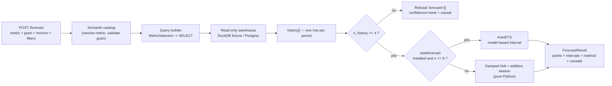

# 13 — Forecasting

The insight engine explains **why a metric changed**
([`05-insight-engine.md`](05-insight-engine.md)). Forecasting answers the other
half of the executive question: **what happens next**. It projects a governed
metric forward over the same semantic layer the dashboards read, and — this is
the design's whole point — it is willing to say *"there is not enough history to
answer that."*

Related reading: the governed metrics and query builder in
[`02-data-model.md`](02-data-model.md) §6 and
[`05-insight-engine.md`](05-insight-engine.md) §3; the read-only execution
guardrails in [`08-security.md`](08-security.md); the API envelope, roles and
rate limits in [`06-api.md`](06-api.md).

## 1. The stance: a forecast is a claim, not a decoration

A single confident-looking number is the most dangerous thing a BI tool can
render. Everything below follows from refusing to produce one:

1. **Every forecast carries a prediction interval.** There are no bare point
   estimates in the response model — `ForecastPoint` has `lower` and `upper`, and
   `lower <= value <= upper` always holds.
2. **Every forecast names its method and its evidence base.** `method`,
   `method_family` and `n_history` say which engine produced the numbers and how
   many periods it saw. A reader never has to guess.
3. **Short history is flagged, loudly.** `confidence` grades the result and
   `low_confidence` is a boolean the UI can gate on. It stays `true` until the
   history is genuinely long.
4. **Below the floor, the system refuses.** With fewer than **4** periods the
   response has an *empty* `forecast` list, `confidence: "none"`, and a caveat
   saying how many periods exist and how many are required.
5. **Ratio metrics are forecast in their own units.** Metrics marked
   `additive: false` in the catalog (margin %, return rate, AOV) are projected
   directly from their own period values. Segment forecasts of a ratio are never
   summed — the same rule the contribution analysis follows.

### 1.1 What this means on the demo warehouse

The fixture warehouse holds **two quarters** (2026Q1 and 2026Q2 — see
[`02-data-model.md`](02-data-model.md) §8). Two points is enough to compute a
period-over-period *change*, which is why anomaly detection works there; it is
nowhere near enough to fit a trend with an honest interval.

So on the demo data, `POST /api/v1/forecast` returns **200 with no numbers**:

```json
{
  "metric": "revenue",
  "grain": "quarter",
  "history": [{"period": "2026Q1", "value": 1300000.0},
              {"period": "2026Q2", "value": 1152000.0}],
  "forecast": [],
  "method": "none — insufficient history",
  "method_family": "none",
  "n_history": 2,
  "confidence": "none",
  "low_confidence": true,
  "caveats": [
    "Refused to forecast: 2 quarter(s) of history, 4 required. A projection from this little data would be a guess dressed as an estimate."
  ],
  "headline": "Not enough history to forecast Revenue at quarter grain: 2 period(s) available, 4 required."
}
```

That output is the feature working, not the feature failing. The `history` array
is still returned so the UI can draw the observed line with an explicit "no
projection" state. Point a real Postgres warehouse with years of data at the same
endpoint and the forecast appears, with the caveats that history earns.

## 2. Where the numbers come from

History is read through the **governed path only**: catalog → validated
`MetricSelection` → deterministic query builder → guardrails → read-only
executor. There is no free SQL anywhere in this package, and an ungoverned metric
never reaches the warehouse.



Filters are the same governed filters `POST /metrics/query` accepts, so
"forecast revenue for the North region" is a filter, not a different code path.

## 3. The pure-Python method (the default)

`app/forecast/smoothing.py`, stdlib only. Four steps:

1. **Seasonality.** The grain implies a cycle length (`quarter` → 4, `month` →
   12, `week` → 52, `day` → 7, `year` → 1). If the history covers **two full
   cycles**, fit a least-squares line, average the residuals by position in the
   cycle, and centre them to mean zero — a seasonal-naive profile estimated on
   detrended data. With less than two cycles there is no seasonal term at all,
   and a caveat says so rather than letting one cycle masquerade as a pattern.
2. **Damped Holt linear trend** on the deseasonalised series, in error-correction
   form, with `(alpha, beta, phi)` chosen by a small grid search minimising
   one-step-ahead squared error. Damping (`phi < 1`) is deliberate: an undamped
   line extrapolated eight quarters out is fiction.
3. **Projection.** `level + Σ phi^i · trend`, with the seasonal term added back.
4. **Interval.** `sigma` is the residual standard error of the one-step-ahead
   fit; the h-step half-width is `z · sigma · √h`, widening with the horizon the
   way random-walk error accumulates. `z` is the normal quantile for the
   requested level (default **80%**).

**Honest limitation, stated here rather than discovered later:** this is a
*fit-residual* interval, not a full parameter-uncertainty interval, and it uses a
normal rather than a Student-t quantile. It therefore understates risk on short
histories. That is exactly why the engine refuses below four periods and caps
confidence at `low` below eight.

### 3.1 Degenerate input

| Input | Behaviour |
|---|---|
| 0 or 1 period | Refusal; caveat naming the row count |
| 2–3 periods | Refusal (the demo-warehouse case) |
| Perfectly constant series | Forecasts the constant; `sigma` is exactly 0 so the interval has **zero width** — no division by zero — plus a caveat that this reflects the input, not certainty |
| All-zero series | Same, finite, no `NaN` |
| Missing periods in the middle | Forecast proceeds, with a caveat naming the missing labels — the model assumes even spacing and the reader is told it isn't |
| Horizon longer than half the history | Confidence forced to `low` plus an "this is extrapolation" caveat |
| Percent metric | Points and bounds clamped to `[0, 1]` when the whole history sits there (a negative return rate is not a thing) |
| Non-negative count metric | Bounds clamped at 0 |
| Unparseable period labels | Future labels degrade to `"<last>+1"`; nothing raises |

### 3.2 Confidence grades

| `n_history` | `confidence` | `low_confidence` |
|---|---|---|
| < 4 | `none` (no forecast emitted) | `true` |
| 4–7 | `low` | `true` |
| 8–15 | `medium` | `false` |
| ≥ 16 | `high` | `false` |

A horizon greater than `n_history / 2` demotes any grade to `low`.

## 4. The optional statistical backend

When the optional extra is installed **and** the history has at least 8 periods,
`statsforecast`'s **AutoETS** runs instead: proper model selection across
error/trend/season forms with a model-based interval. The result reports
`method_family: "statsforecast"` and `method: "statsforecast AutoETS"`, so a
number's provenance is always visible in the payload.

The optional path is defensive by construction: the import is lazy, and any
failure inside it (missing wheel, fit error, non-finite output) returns `None`
and the pure-Python fallback runs. An optional accelerator must never be able to
fail a request.

## 5. Dependency posture

`statsforecast` lives in `[project.optional-dependencies].forecast`, not in the
base dependencies:

```bash
uv pip install -e ".[forecast]"     # opt in to AutoETS/ARIMA/Theta
```

The reasoning matches the project's standing bias toward a small dependency
surface (each dependency is a thing that can break): `statsforecast` pulls
**numpy + pandas + numba**, a heavy, compiler-adjacent chain that is hostile to
the "runs offline on a modest laptop" default and slow to install in CI. So:

- the base install and CI never see it;
- availability is probed at **runtime**, not at import time;
- the test suite passes on the fallback alone, and the optional path is covered
  through its availability probe and a stubbed backend.

### 5.1 Rejected alternatives

| Decision | Chosen | Rejected | Why |
|---|---|---|---|
| Statistical engine | **`statsforecast` (AutoETS), optional** | **Prophet** | Prophet is far heavier (pystan/cmdstanpy toolchain), slower to fit, and brings a compiler dependency for no accuracy gain on short business series; `statsforecast` is orders of magnitude faster and installs as wheels |
| Default engine | **Pure-Python damped Holt fallback** | Require the statistical engine | Keeps the offline default and CI dependency-free; a forecast should not be gated on a 200 MB install |
| Short history | **Refuse, and say why** | Emit a forecast with a wide interval | A wide interval still renders as a line on a chart and gets quoted as a number; refusal cannot be misread |
| Interval | **Always present, per point** | Point estimate with an optional interval | An optional interval is an interval nobody reads |
| Deep learning (LSTM/N-BEATS) | **Not used** | — | No training data, no GPU budget, and unexplainable output in a product whose thesis is explainability |
| Ratio metrics | **Forecast the ratio directly** | Forecast numerator and denominator, or sum segments | Ratio deltas do not compose; summing them is the classic Simpson's-paradox bug |
| LLM-authored forecasts | **Never** | Ask the model for next quarter's number | Same rule as the rest of the system: a model narrates numbers, it never sources them |

## 6. API

Both routes sit under `/api/v1` and use the standard error envelope from
[`06-api.md`](06-api.md) §5.

### 6.1 `POST /api/v1/forecast` — analyst+

Rate-limited in the `read` bucket. The blocking warehouse read and model fit run
in a threadpool so the event loop stays free.

```jsonc
// request
{
  "metric": "revenue",           // governed metric key or alias
  "grain": "quarter",            // any governed date grain
  "horizon": 4,                  // 1..12
  "interval_level": 0.8,         // 0.5..0.99
  "filters": {"region": "North"} // or the explicit list form
}
```

Response: `ForecastResult` — `history[]`, `forecast[]` (`period`, `value`,
`lower`, `upper`), `method`, `method_family`, `n_history`, `interval_level`,
`confidence`, `low_confidence`, `caveats[]`, `headline`.

| Situation | Status |
|---|---|
| Success, or an honest refusal | `200` |
| Ungoverned metric, unknown grain, rejected filter, warehouse rejection | `400 bad_request` |
| Malformed body (horizon out of range, bad types) | `422 validation_error` |
| Missing or invalid token | `401 unauthorized` |
| Viewer role | `403 forbidden` |
| Warehouse unreachable | `503 dependency_unavailable` |
| — | **never `500`** |

### 6.2 `GET /api/v1/forecast/metrics?grain=quarter` — viewer+

The capability report: for every governed metric, its `n_history` at that grain,
whether it is `forecastable`, and a `reason` when it is not. On the demo
warehouse every row comes back `forecastable: false` with "Not enough history: 2
quarter(s) available, 4 required" — which is the point. The report also names the
engine that *would* run (`method_family` / `method`), so the dependency posture
is visible without reading the lockfile.

## 7. Layout and tests

```
services/api/app/forecast/
  models.py      # ForecastPoint, ForecastResult, the capability report
  engine.py      # governed history read, method choice, caveats, refusal
  smoothing.py   # the pure-Python damped Holt + additive season
  backends.py    # lazy statsforecast probe + adapter
  periods.py     # period-label arithmetic and gap detection
services/api/app/api/routers/forecast.py
services/api/tests/test_forecast.py
```

`tests/test_forecast.py` runs fully offline on the fallback and pins the
behaviours this document promises: a bracketed, widening interval on a long
synthetic history; the two-quarter refusal on the real fixture warehouse; a
ratio metric forecast in its own units and clamped; a constant series that does
not explode; missing-period caveats; `400` for an ungoverned metric; `403` for a
viewer; `503` for an unreachable warehouse; and no `500` on any path.

**Not yet wired:** the frontend does not render forecasts. The API and the
capability report exist; the UI surface is a separate piece of work.

---
